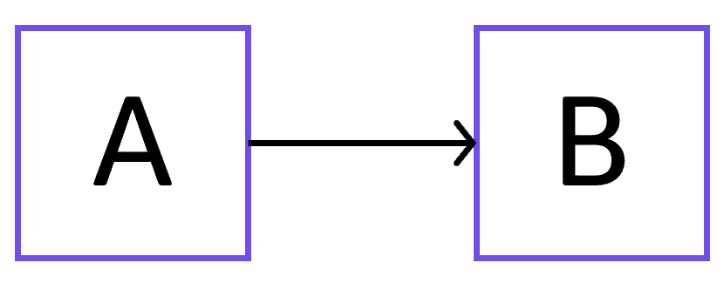
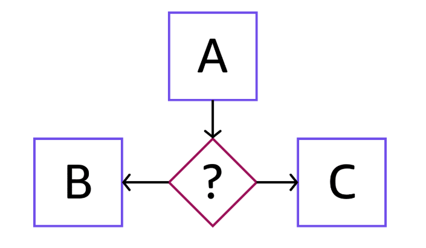
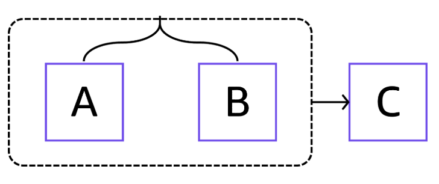
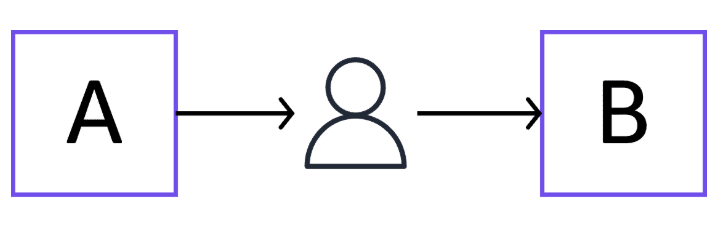

# Step Functions - Arquitecure & Core Concepts

## Technical Concepts

- State Machine 
  - Is a JSON document defining the workflow and the sequence of states it goes through.
  - Serves as a visual representation of the entire workflow. 

- State 
  - In an indivisual step or task (state) within the state machine workflow.
  - Different states exists, each one serving for an specific purpose such as:
    - Task 
    - Choise
    - Wait 
    - Parallel 
    - Map States

## States

### Task 

- A task state performs a job. Jobs include invoking a Lambda function, running an AWS Batch job, or sending a message to an Amazon SQS queue.

- Data is passed between states as the workflow progresses.

- The output of one state can become the input for the next state, facilitating data flow and transformation.

### Choise

A choice state allows branching logic based on the input data, enabling conditional execution of different workflow paths.

### Parallel

A parallel state allows concurrent execution of multiple workflow branches, enabling parallel processing of tasks.

### Error Handling

Error handling is a mechanism for handling errors and exceptions that might occur during state machine execution, for resilience and proper error management. You can retry failed tasks, or catch failed tasks and automatically run alternative steps.

### Human in the Loop

Step Functions can include human approval steps in the workflow. For example, imagine a banking customer attempts to send funds to a friend. With a callback and a task token, you can have Step Functions wait until the customer's friend confirms the transfer. Then Step Functions will continue the workflow to notify the banking customer that the transfer has completed.

