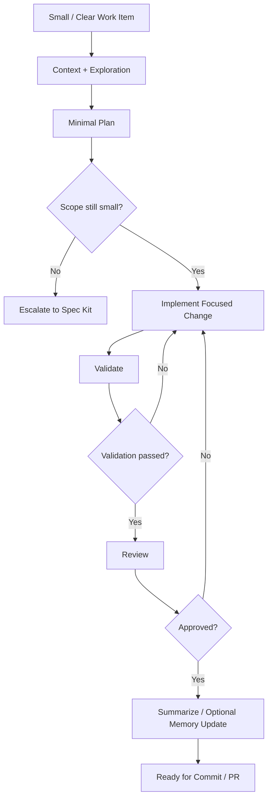

# Claude Code Direct Mode Setup

## Purpose

This document describes the Claude Code setup created to support a controlled **Direct Mode** workflow for daily software engineering tasks.

The goal of this setup is to make Claude Code useful for small, clear, low-risk tasks while keeping the engineer in control of scope, validation, review, and final decisions.

Direct Mode is intended for focused work such as:

- Small bug fixes
- Failing test investigations
- Focused refactors
- Missing tests
- Small UI/backend changes
- Code explanation
- PR self-review

For larger or unclear work, the workflow should escalate to a more structured process such as Spec Kit or another spec-driven workflow.

---

## High-Level Philosophy

Claude Code should not be used as an uncontrolled code generator.

Instead, it should behave like a structured engineering assistant:

```txt
Explore first
→ explain current behavior
→ propose a minimal plan
→ wait for approval when needed
→ implement the focused change
→ validate
→ self-review
→ summarize
```

The human engineer remains responsible for:

- Deciding whether the task is small enough for Direct Mode
- Approving or narrowing the plan
- Controlling scope
- Reviewing the final diff
- Deciding what validation is enough
- Escalating to Spec Kit when the task becomes larger than expected

---

## Folder Structure

The current global Claude setup lives under:

```txt
~/.claude/
```

Current structure:

```txt
~/.claude/
  CLAUDE.md
  commands/
    close-session.md
    debug-failure.md
    direct.md
    explain-code.md
    review-diff.md
  skills/
    senior-engineer-reviewer/
      SKILL.md
    web-ui-reviewer/
      SKILL.md
```

---

## Global vs Project-Specific Setup

### Global Claude Setup

The global setup defines how Claude should behave across all repositories.

It should remain mostly technology-agnostic.

Examples of global rules:

- Act as a senior software engineer
- Inspect the repository before assuming the stack
- Check git status before editing
- Avoid unrelated refactors
- Do not add dependencies without approval
- Run targeted validation when possible
- Do not claim tests passed unless they were actually run
- Keep changes small and reviewable

Global files:

```txt
~/.claude/CLAUDE.md
~/.claude/commands/*
~/.claude/skills/*
```

### Project-Specific Setup

Each repository can have its own `CLAUDE.md` file with repo-specific details.

Example:

```txt
repo/CLAUDE.md
```

Project-specific information may include:

- Tech stack
- Package manager
- Common commands
- Folder structure
- Testing strategy
- Architecture rules
- Design system rules
- Repo-specific constraints

Rule of thumb:

```txt
If it describes how I work → global.
If it describes how this repo works → project-specific.
```

---

## Commands

Commands are explicit workflows that the user triggers manually.

A command answers:

```txt
What should Claude do right now?
What sequence should it follow?
What output should it produce?
```

### `/direct`

Main command for small, clear, low-risk tasks.

Use it for:

- Small bug fixes
- Focused refactors
- Missing tests
- Small implementation tasks
- Simple investigations

Expected flow:

```txt
Read request
→ check git status
→ explore relevant files
→ explain current behavior/root cause
→ propose minimal plan
→ implement approved scope
→ validate
→ self-review
→ summarize
```

Example usage:

```txt
/direct ProductCard shows NaN when rating is missing. Investigate and fix it.
```

---

### `/debug-failure`

Focused command for failing tests, build errors, typecheck errors, lint errors, or runtime failures.

Use it when there is a specific failure output to investigate.

Expected flow:

```txt
Read failure output
→ inspect smallest relevant area
→ explain what failed and why
→ propose smallest safe fix
→ implement focused fix
→ rerun failing validation
→ summarize root cause and fix
```

Example usage:

```txt
/debug-failure pnpm test ProductList.test.tsx is failing with this output: ...
```

---

### `/review-diff`

Command for reviewing the current git diff before opening a PR or committing.

Use it for:

- PR self-review
- Final quality check
- Detecting scope creep
- Finding missing tests
- Reviewing correctness and risks

Expected review areas:

- Correctness
- Edge cases
- Security
- Accessibility, when UI code is involved
- Performance
- Type safety, when applicable
- Test coverage
- Scope creep
- Unnecessary complexity

Example usage:

```txt
/review-diff
```

---

### `/explain-code`

Command for understanding code without editing files.

Use it for:

- Onboarding into an unfamiliar repo
- Understanding a feature flow
- Tracing data flow
- Understanding responsibilities across files
- Preparing before making changes

Example usage:

```txt
/explain-code Explain how the product filtering flow works.
```

---

### `/close-session`

Command for ending a working session and preserving useful context.

Use it when:

- A task is complete
- You want a summary of work done
- You want to preserve decisions or follow-ups
- You are switching context

Expected output:

- Completed work
- Files changed
- Decisions made
- Validation run
- Risks or follow-ups
- Suggested next step

Example usage:

```txt
/close-session
```

---

## Skills

Skills are reusable areas of expertise that Claude can apply when relevant.

A skill answers:

```txt
What specialized lens should Claude use while doing the work?
```

Skills are different from commands:

```txt
Command = workflow
Skill = expertise
```

---

### `senior-engineer-reviewer`

General review skill for software engineering work.

Use it when reviewing:

- Code changes
- Plans
- Diffs
- Implementation choices
- Risky modifications

Main focus:

- Correctness
- Edge cases
- Security
- API/contract compatibility
- Test coverage
- Maintainability
- Performance
- Scope control

---

### `web-ui-reviewer`

Frontend-specific review skill.

Use it when the task involves:

- Web UI
- React
- Browser behavior
- User interactions
- UI components
- Accessibility
- Frontend performance

Main focus:

- Rendering behavior
- Loading/error/empty/success states
- Accessibility
- Semantic HTML
- Keyboard interaction
- State ownership
- Effect dependency issues
- Unnecessary re-renders
- User-facing tests
- Component consistency

---

## Claude Direct Mode Workflow

The Direct Mode workflow is intentionally lightweight but controlled.

```txt
Small / clear task
→ Context + exploration
→ Minimal plan
→ Scope decision
→ Focused implementation
→ Validation
→ Review
→ Summary / optional memory update
```

### 1. Small / Clear Task

The task should be small enough to complete with a focused diff.

Good Direct Mode tasks:

- Fix a small bug
- Investigate a failing test
- Add a missing test
- Refactor one function/component
- Explain a specific code flow
- Review a current diff

Bad Direct Mode tasks:

- Build a new feature
- Change architecture
- Modify several modules
- Work with unclear requirements
- Implement a new user flow
- Perform a large refactor

If the task needs acceptance criteria, use Spec Kit instead.

---

### 2. Context + Exploration

Claude should first inspect the relevant context.

This usually includes:

- Reading the user request
- Checking `git status --short`
- Inspecting nearby files
- Looking at existing patterns
- Understanding current behavior

Claude should not edit files during this phase.

Goal:

```txt
Understand before changing.
```

---

### 3. Minimal Plan

Before implementation, Claude should explain:

- Current behavior
- Root cause, if applicable
- Smallest safe change
- Files likely affected
- Tests or validation needed

The engineer reviews this plan before allowing implementation when the task is not trivial.

---

### 4. Scope Decision

After exploration, decide whether the task is still small.

Continue Direct Mode if:

- The behavior is clear
- The change is localized
- The diff should be small
- The architecture does not need discussion

Escalate to Spec Kit if:

- Requirements are unclear
- Multiple modules are affected
- API contracts may change
- New UX states need definition
- The implementation is larger than expected
- A broader plan or acceptance criteria is needed

---

### 5. Focused Implementation

Claude implements only the approved scope.

Rules:

- Keep changes minimal
- Avoid unrelated refactors
- Do not add dependencies without approval
- Do not modify public APIs/contracts unless required
- Do not implement adjacent improvements
- Follow existing project patterns

---

### 6. Validation

Claude should run the smallest relevant validation first.

Examples:

- Targeted unit test
- Specific failing test
- Typecheck
- Lint
- Build check

Claude must not claim validation passed unless it actually ran the command.

If validation cannot be run, Claude should explain why.

---

### 7. Review

Review happens in two layers:

```txt
Claude self-review
→ Human/senior engineer review
```

Claude self-review should check:

- Scope creep
- Missing tests
- Obvious bugs
- Unnecessary complexity
- Risky changes
- Inconsistent patterns

The human engineer gives final approval.

---

### 8. Summary / Optional Memory Update

At the end, Claude should summarize:

- What changed
- Files changed
- Validation run
- Risks or follow-ups

If the context is useful for future sessions, `/close-session` can update or suggest updating a session summary.

For tiny fixes, memory updates may not be necessary.

---

## Direct Mode Diagram



---

## Real Example: Small Bug Fix

User runs:

```txt
/direct ProductCard shows NaN when rating is missing. Investigate and fix it.
```

Expected Claude behavior:

```txt
1. Check git status.
2. Inspect ProductCard and related tests.
3. Explain why NaN appears.
4. Propose the smallest safe fix.
5. Wait for approval if needed.
6. Implement the focused change.
7. Add or update a regression test if practical.
8. Run targeted validation.
9. Self-review the diff.
10. Summarize changed files, validation, and risks.
```

Expected human responsibility:

```txt
1. Confirm the expected behavior.
2. Approve or narrow the plan.
3. Prevent scope creep.
4. Review the final diff.
5. Decide if validation is sufficient.
```

---

## Relationship With Spec Kit

Direct Mode is not a replacement for Spec Kit.

Use Direct Mode when the task is small and clear.

Use Spec Kit when the task is larger, unclear, or requires formal requirements.

```txt
Direct Mode:
fast, focused, lightweight

Spec Kit:
structured, documented, better for larger work
```

Decision rule:

```txt
If the task needs acceptance criteria, use Spec Kit.
If the task needs a small safe change, use Direct Mode.
```

---

## Current Setup Summary

The current setup gives us:

```txt
/direct
  Main workflow for small tasks

/debug-failure
  Specialized workflow for failing commands/errors

/review-diff
  Senior review workflow for current changes

/explain-code
  Understanding workflow without edits

/close-session
  Session summary and continuity workflow

senior-engineer-reviewer skill
  General software engineering review lens

web-ui-reviewer skill
  Frontend-specific review lens
```

Together, these create a controlled Claude Code workflow for daily engineering work.

The setup is intentionally minimal and can be expanded later with:

- Spec Kit task implementation command
- Repo-specific `CLAUDE.md` templates
- Hooks for validation
- Memory tools like Engram
- Semantic code search MCP
- Additional domain-specific skills
