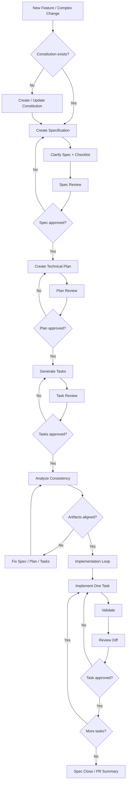
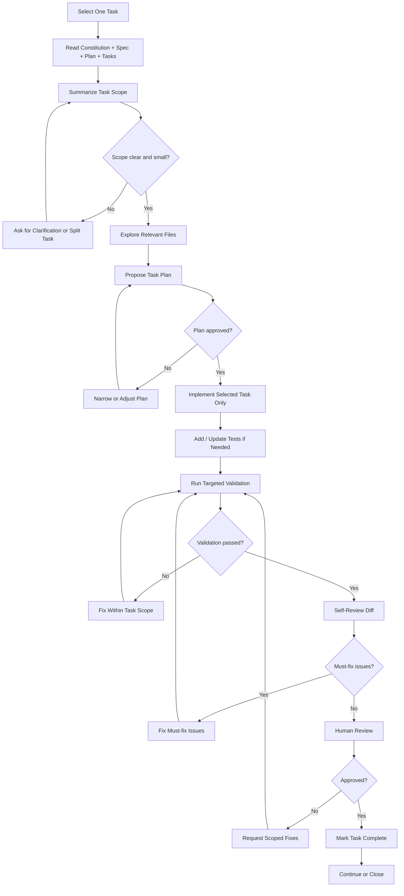

# Claude Code Spec-Driven Workflow Setup

## Purpose

This document describes the Claude Code + Spec Kit workflow created to support a controlled **Spec-Driven Development** process.

The goal of this setup is to use Spec Kit to define requirements, plans, and tasks, while using Claude Code as a controlled implementation assistant.

This workflow is intended for work that is larger or less clear than Claude Direct Mode.

Use Spec-Driven workflow for:

- New features
- Multi-step user flows
- Unclear requirements
- Multi-file or multi-module changes
- Architecture-sensitive changes
- Large or risky refactors
- Work that needs acceptance criteria
- Work that may need to be resumed later

Use Claude Direct Mode instead for:

- Small bug fixes
- Focused test fixes
- Small refactors
- Code explanation
- PR self-review
- Low-risk isolated changes

---

## High-Level Philosophy

Spec Kit should not be treated as “AI implements everything automatically.”

Instead, the workflow should be:

```txt
Spec Kit creates the map.
Claude Code executes one controlled task at a time.
The engineer controls the checkpoints.
```

The core idea:

```txt
Constitution
→ Specification
→ Clarification / Checklist
→ Technical Plan
→ Task Breakdown
→ Analyze Consistency
→ Implement One Task at a Time
→ Validate
→ Review
→ Close / PR Summary
```

This keeps the work:

- Clear
- Reviewable
- Validated
- Scoped
- Easier to resume
- Easier to rollback
- Less likely to drift from requirements

---

## Current Global Claude Setup

The global Claude setup lives under:

```txt
~/.claude/
```

Recommended structure after adding Spec-Driven commands:

```txt
~/.claude/
  CLAUDE.md
  commands/
    close-session.md
    debug-failure.md
    direct.md
    explain-code.md
    review-diff.md

    spec-review.md
    spec-plan-review.md
    spec-task-review.md
    spec-implement-task.md
    spec-close.md

  skills/
    senior-engineer-reviewer/
      SKILL.md
    web-ui-reviewer/
      SKILL.md
```

---

## Spec Kit Artifacts

Spec Kit creates and uses several important artifacts.

These artifacts are the source of truth for the feature.

Typical Spec Kit structure:

```txt
.specify/
  memory/
    constitution.md
  specs/
    001-feature-name/
      spec.md
      plan.md
      tasks.md
      research.md
      data-model.md
      contracts/
      quickstart.md
```

The exact generated files can vary depending on the project and Spec Kit flow, but the key artifacts are:

```txt
constitution.md = project governance
spec.md = what the feature must do
plan.md = how the feature should be implemented
tasks.md = executable implementation tasks
```

---

## Artifact Responsibilities

### `constitution.md`

The constitution is the project’s engineering rulebook.

It defines the non-negotiable principles that future specs, plans, tasks, and implementation must follow.

It usually lives at:

```txt
.specify/memory/constitution.md
```

It should be created once per project and updated rarely.

It answers:

- What engineering principles must always be respected?
- What quality bar should the project maintain?
- What should AI-assisted work never violate?
- How should future features be governed?

Examples of constitution rules:

- Preserve existing behavior unless the spec explicitly changes it.
- Do not introduce dependencies without approval.
- All user-facing async UI should handle loading, error, empty, and success states.
- Bug fixes should include regression tests when practical.
- Follow existing project patterns.

---

### `spec.md`

The specification defines the feature from a product and behavior perspective.

It answers:

- What problem are we solving?
- Who is the user?
- What should the user be able to do?
- What are the acceptance criteria?
- What UX states are required?
- What edge cases matter?
- What is out of scope?

The spec should avoid low-level implementation details.

Good spec language:

```txt
Users can search products by name, filter by category, clear all filters, and see an empty state when no results match.
```

Avoid spec language like:

```txt
Create a React component with useState and useMemo.
```

Implementation details belong in the plan, not the spec.

---

### `plan.md`

The technical plan translates the spec into an engineering approach.

It answers:

- What files or areas are likely impacted?
- What data flow should be used?
- What components, services, hooks, or modules need changes?
- What testing strategy should be followed?
- What risks or tradeoffs exist?
- What validation should run?
- Are there accessibility, performance, security, or API concerns?

The plan should be reviewed before tasks are generated.

---

### `tasks.md`

The task list breaks the plan into executable implementation steps.

Good tasks are:

- Small
- Ordered
- Clear
- Testable
- Reviewable
- Independently implementable
- Aligned with the spec and plan

Bad tasks are too broad, for example:

```txt
Implement the whole feature.
```

Good tasks are focused, for example:

```txt
T001 Add filterProducts utility with unit tests.
T002 Add SearchInput component.
T003 Wire SearchInput into ProductSearchPage.
T004 Add empty state for no matching results.
T005 Add component tests for search/filter behavior.
```

---

## Commands

Commands are explicit workflows that the user triggers manually.

A command answers:

```txt
What should Claude do right now?
What sequence should it follow?
What output should it produce?
```

The Spec-Driven workflow uses both Spec Kit commands and custom Claude commands.

---

## Spec Kit Commands

### `/speckit.constitution`

Creates or updates the project constitution.

Use this when setting up Spec Kit in a project for the first time or when the project governance needs a rare intentional update.

Example:

```txt
/speckit.constitution Create a project constitution for this existing Web UI codebase. Inspect the repository first and formalize the current engineering patterns.
```

---

### `/speckit.specify`

Creates the feature specification.

Use this when starting a new feature or complex change.

Example:

```txt
/speckit.specify Add product search and filters.

Users should be able to search products by name, filter by category, clear all filters, and see an empty state when no products match. Existing sorting behavior must be preserved.
```

---

### `/speckit.clarify`

Improves the spec by identifying unclear requirements, missing edge cases, and unresolved product questions.

Use it after the initial spec is created.

Example:

```txt
/speckit.clarify Focus on missing UX states, accessibility expectations, edge cases, and unclear acceptance criteria.
```

---

### `/speckit.checklist`

Creates or validates a checklist for the spec.

Use it to verify the quality of the specification before technical planning.

---

### `/speckit.plan`

Creates the technical implementation plan.

Use it after the spec is reviewed and accepted.

Example:

```txt
/speckit.plan Follow the existing project architecture. Avoid new dependencies. Preserve current behavior unless the spec explicitly changes it. Include testing, accessibility, and validation strategy.
```

---

### `/speckit.tasks`

Generates implementation tasks from the spec and plan.

Use it only after the plan is reviewed and accepted.

---

### `/speckit.analyze`

Checks consistency across the constitution, spec, plan, and tasks.

Use it before implementation to catch contradictions, missing details, and alignment issues.

---

### `/speckit.implement`

This command may implement the generated tasks, but in our workflow it is **not the default**.

For senior engineering control, we prefer implementing one task at a time with:

```txt
/spec-implement-task
```

Reason:

- Smaller diffs
- Better reviewability
- Less scope creep
- Easier rollback
- Better validation after each task
- More human control at each checkpoint

---

## Custom Spec-Driven Commands

These are the custom commands added to Claude Code to govern the Spec Kit workflow.

---

### `/spec-review`

Reviews the generated `spec.md` before moving to technical planning.

Use after:

```txt
/speckit.specify
/speckit.clarify
/speckit.checklist
```

Purpose:

- Validate that the requirements are clear
- Check acceptance criteria
- Check UX states
- Check edge cases
- Check out-of-scope boundaries
- Check alignment with the constitution

Expected output:

- Spec readiness verdict
- Missing requirements
- Suggested refinements
- Questions for the human
- Whether it is safe to proceed to `/speckit.plan`

---

### `/spec-plan-review`

Reviews the generated `plan.md` before generating tasks.

Use after:

```txt
/speckit.plan
```

Purpose:

- Check if the technical approach is realistic
- Verify alignment with the spec
- Verify alignment with the constitution
- Detect over-engineering
- Check testing and validation strategy
- Check accessibility, performance, security, and API concerns

Expected output:

- Plan readiness verdict
- Main risks
- Suggested improvements
- Over-engineered or unnecessary parts
- Missing validation/testing details
- Whether it is safe to proceed to `/speckit.tasks`

---

### `/spec-task-review`

Reviews `tasks.md` before implementation starts.

Use after:

```txt
/speckit.tasks
```

Purpose:

- Ensure tasks are small enough
- Ensure tasks are ordered correctly
- Ensure tasks are executable
- Ensure tasks are testable
- Ensure tasks are aligned with the spec and plan
- Detect missing or risky tasks

Expected output:

- Task readiness verdict
- Tasks that should be split
- Missing tasks
- Risky tasks
- Suggested implementation order
- Whether task-by-task implementation can start

---

### `/spec-implement-task`

Implements exactly one task from the Spec Kit task list.

This is the most important command in the workflow.

Use instead of blindly implementing the whole spec.

Example:

```txt
/spec-implement-task T003 from specs/001-product-filter
```

Expected flow:

```txt
Read constitution/spec/plan/tasks
→ locate selected task
→ summarize scope
→ explore relevant files
→ propose small plan
→ implement selected task only
→ add/update tests if needed
→ run targeted validation
→ self-review diff
→ summarize result
```

Rules:

- Implement only the selected task
- Do not implement adjacent tasks
- Do not perform unrelated refactors
- Do not add dependencies without approval
- Do not modify public APIs/contracts unless required by the selected task
- If the task is too large, stop and recommend splitting it

---

### `/spec-close`

Closes or summarizes the current Spec Kit feature work.

Use when finishing a work session or preparing a PR.

Purpose:

- Summarize completed tasks
- Summarize remaining tasks
- Summarize files changed
- Summarize decisions made
- Summarize validation run
- Identify risks and follow-ups
- Draft a PR summary if the feature is ready

Expected output:

- Feature/spec name
- Completed tasks
- Remaining tasks
- Files changed
- Important decisions
- Validation run
- Risks or follow-ups
- Suggested next task
- PR summary draft, if applicable

---

## Spec-Driven Workflow

The full Spec-Driven workflow looks like this:

```txt
New Feature / Complex Change
→ Constitution check
→ Specification
→ Clarification
→ Checklist
→ Human Spec Review
→ Technical Plan
→ Human Plan Review
→ Task Generation
→ Human Task Review
→ Analyze Consistency
→ Task-by-task Implementation
→ Final Review
→ PR Summary / Close
```

---

## Workflow Diagram



---

## Implementation Loop

The implementation loop is repeated for each task.

```txt
Select one task
→ Read context
→ Explore relevant files
→ Propose small implementation plan
→ Implement focused change
→ Validate
→ Self-review
→ Human review
→ Mark task complete
→ Continue to next task
```

---

## Implementation Loop Diagram



---

## Human Responsibilities

The engineer is responsible for the key checkpoints.

### Before Specification

Decide whether the task belongs in Spec Kit.

Use Spec Kit when:

- The task needs acceptance criteria
- Requirements are unclear
- Multiple modules are involved
- UX behavior needs definition
- Architecture may be affected
- The work may be resumed later

---

### During Spec Review

Check:

- Is the user behavior clear?
- Are acceptance criteria complete?
- Are edge cases defined?
- Are UX states covered?
- Is the scope controlled?
- Is anything ambiguous?
- Is anything implementation detail too early?

---

### During Plan Review

Check:

- Does the approach match the existing architecture?
- Is the plan realistic?
- Is the plan over-engineered?
- Are tests included?
- Are risks documented?
- Does the plan avoid unnecessary dependencies?
- Are API or contract changes justified?

---

### During Task Review

Check:

- Are tasks small enough?
- Are tasks ordered correctly?
- Are test tasks included?
- Are tasks independently reviewable?
- Are tasks aligned with the spec and plan?
- Should any task be split?

---

### During Implementation

The engineer controls:

- Which task is next
- Whether the proposed plan is safe
- Whether the diff stays in scope
- Whether validation is enough
- Whether the task can be marked complete

---

## Why We Implement One Task at a Time

Although Spec Kit provides an implementation command, this workflow intentionally prefers task-by-task implementation.

Reason:

```txt
If the work is important enough to need a spec, it is important enough to implement in controlled tasks.
```

Task-by-task implementation gives:

- Smaller diffs
- Better reviewability
- Better control
- Less scope creep
- Easier debugging
- Easier rollback
- Better validation after each step
- Better human-in-the-loop checkpoints

---

## Example Full Flow

### 1. Start the feature

```txt
/speckit.specify Add product search and filters.

Users should be able to search products by name, filter by category, clear all filters, and see an empty state when no products match. Existing sorting behavior must be preserved.
```

---

### 2. Clarify the spec

```txt
/speckit.clarify Focus on missing edge cases, UX states, accessibility, and unclear acceptance criteria.
```

---

### 3. Review the spec

```txt
/spec-review
```

If approved, continue.

---

### 4. Create the technical plan

```txt
/speckit.plan Follow existing project patterns. Avoid new dependencies. Include testing, accessibility, and validation strategy.
```

---

### 5. Review the plan

```txt
/spec-plan-review
```

If approved, continue.

---

### 6. Generate tasks

```txt
/speckit.tasks
```

---

### 7. Review tasks

```txt
/spec-task-review
```

If approved, continue.

---

### 8. Analyze consistency

```txt
/speckit.analyze
```

---

### 9. Implement task by task

```txt
/spec-implement-task T001
/spec-implement-task T002
/spec-implement-task T003
```

Each task should be validated and reviewed before moving to the next one.

---

### 10. Close the feature

```txt
/spec-close
```

---

## Relationship With Direct Mode

Spec-Driven workflow and Direct Mode solve different problems.

```txt
Direct Mode:
Small, clear, low-risk tasks.

Spec-Driven:
Larger, unclear, multi-step, or higher-risk tasks.
```

Decision rule:

```txt
If the task needs acceptance criteria, use Spec Kit.
If the task needs a small safe change, use Direct Mode.
```

---

## Current Setup Summary

The Spec-Driven setup adds these commands:

```txt
/spec-review
/spec-plan-review
/spec-task-review
/spec-implement-task
/spec-close
```

Together with Spec Kit commands:

```txt
/speckit.constitution
/speckit.specify
/speckit.clarify
/speckit.checklist
/speckit.plan
/speckit.tasks
/speckit.analyze
```

The final operating model is:

```txt
Spec Kit generates the artifacts.
Claude Code executes one task at a time.
The engineer controls the checkpoints.
Validation and review protect the codebase.
```

---

## Future Enhancements

This setup can later be extended with:

- Hooks for validation
- Memory tools like Engram
- Semantic code search MCP
- Repo-specific `CLAUDE.md` templates
- Additional domain-specific skills
- PR creation workflow
- Task completion automation
- Team-specific governance rules
