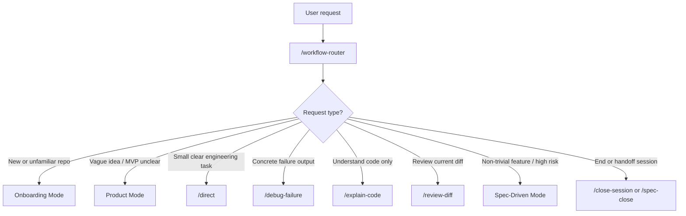
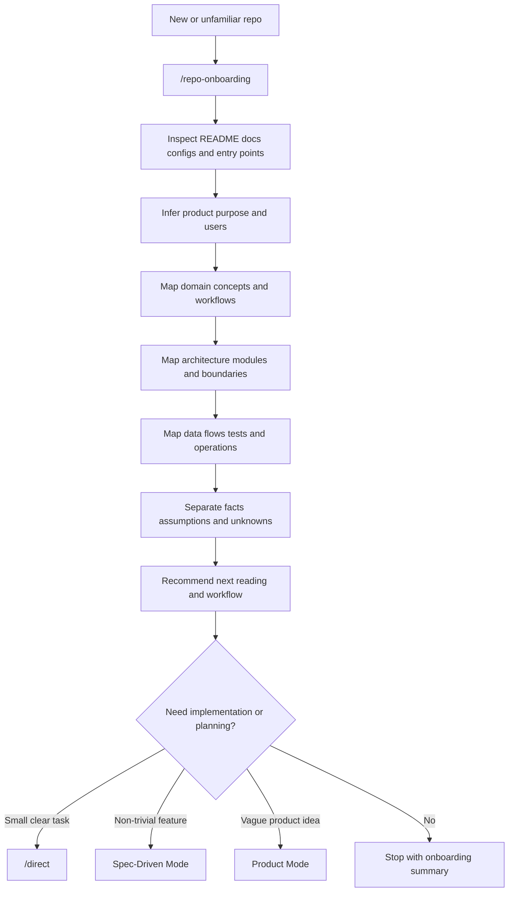
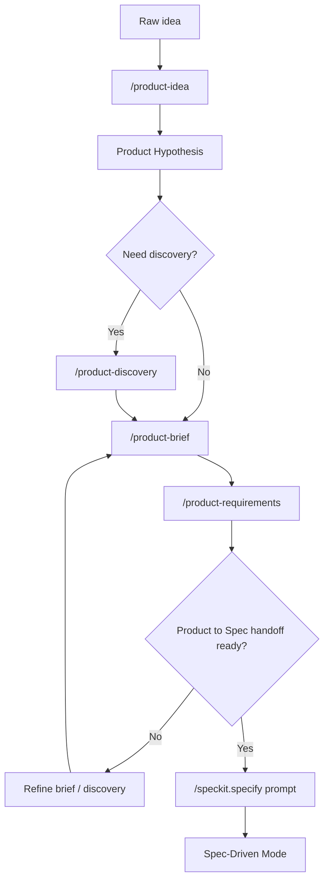
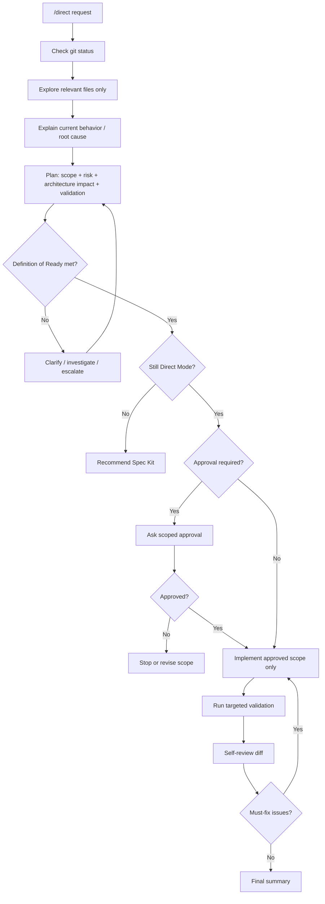
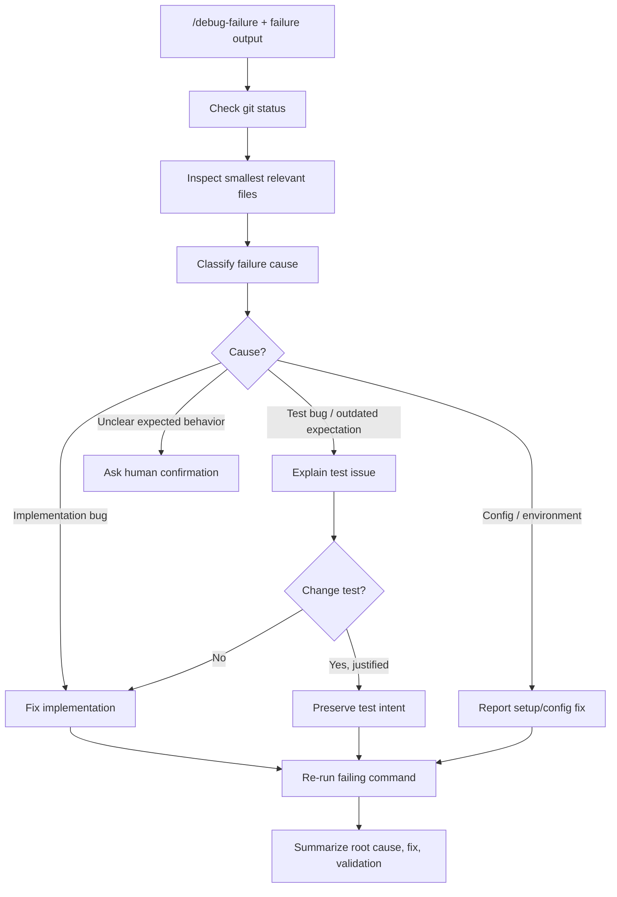
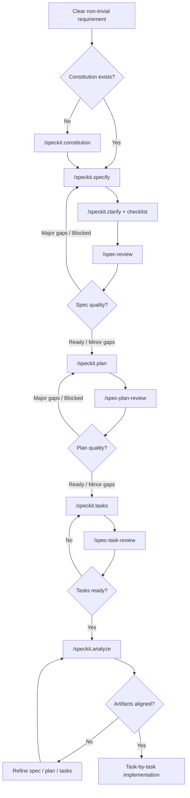
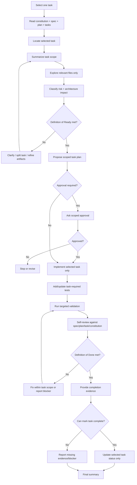
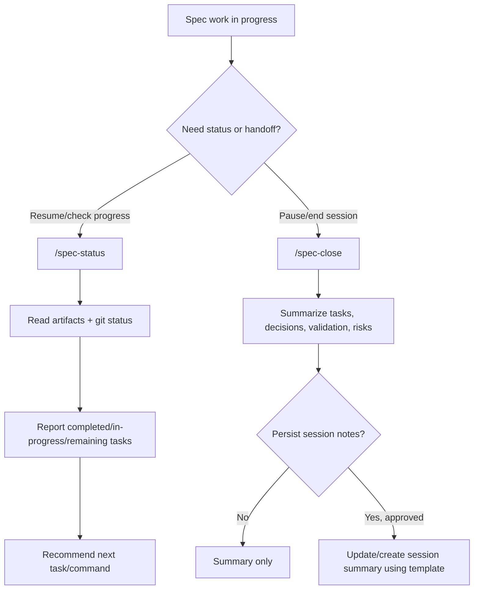
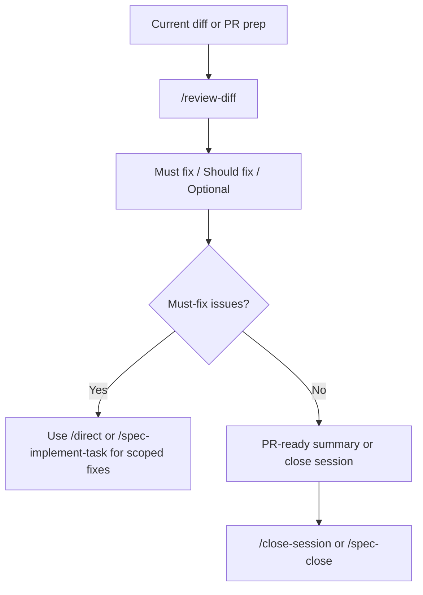

# Claude Workflow Flows

Concise map of the common Claude workflow paths in this setup.

## Workflow Selection

Start with `/workflow-router` when the safest workflow is unclear.

## Onboarding Mode Flow

Use when joining or revisiting an unfamiliar repository and you need product, domain, and architecture context before changing code.

## Product Mode Flow

Use when the problem, user, value proposition, or MVP scope is unclear.

## Direct Mode Flow

Use for small, clear, low-risk engineering tasks.

## Debug Failure Flow

Use when there is concrete failing test/build/typecheck/lint/runtime output.

Test safety rule: do not delete, skip, weaken, broaden assertions, over-mock, or update snapshots blindly just to make failures pass.

## Spec-Driven Flow

Use for non-trivial, high-risk, multi-step, architecture-sensitive, or acceptance-criteria-driven work.

## Spec Task Implementation Loop

Use `/spec-implement-task` for exactly one task at a time.

## Spec Resume / Close Flow

Use `/spec-status` to resume. Use `/spec-close` to pause, hand off, or prepare PR information.

## Review / PR Flow

Use review commands when no implementation should happen by default.

## Command Edit Capability

| Category               | Commands                                                                                                                                                                 | Edit behavior                                                                       |
| ---------------------- | ------------------------------------------------------------------------------------------------------------------------------------------------------------------------ | ----------------------------------------------------------------------------------- |
| Read-only / advisory   | `/workflow-router`, `/repo-onboarding`, `/explain-code`, `/review-diff`, `/spec-review`, `/spec-plan-review`, `/spec-task-review`, `/spec-status`, Product Mode commands | No edits unless user explicitly asks to persist/apply something.                    |
| Implementation-capable | `/direct`, `/debug-failure`, `/spec-implement-task`                                                                                                                      | May edit only after exploration, readiness checks, approval rules, and scoped plan. |
| Session / handoff      | `/close-session`, `/spec-close`                                                                                                                                          | Summary-only by default; persistence requires explicit approval.                    |

## Core Guardrails

- Check `git status --short` before editing.
- Treat existing modified/untracked files as user work.
- Prefer read-only inspection before mutation.
- Use the smallest safe plan.
- Classify risk: Low / Medium / High.
- Classify architecture impact: None / Low / Significant.
- Run targeted validation and report actual results.
- Do not mark Spec Kit tasks complete without completion evidence.
- Do not persist session notes without explicit approval.
