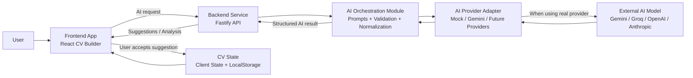
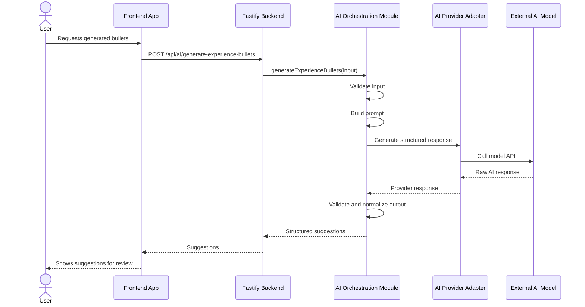
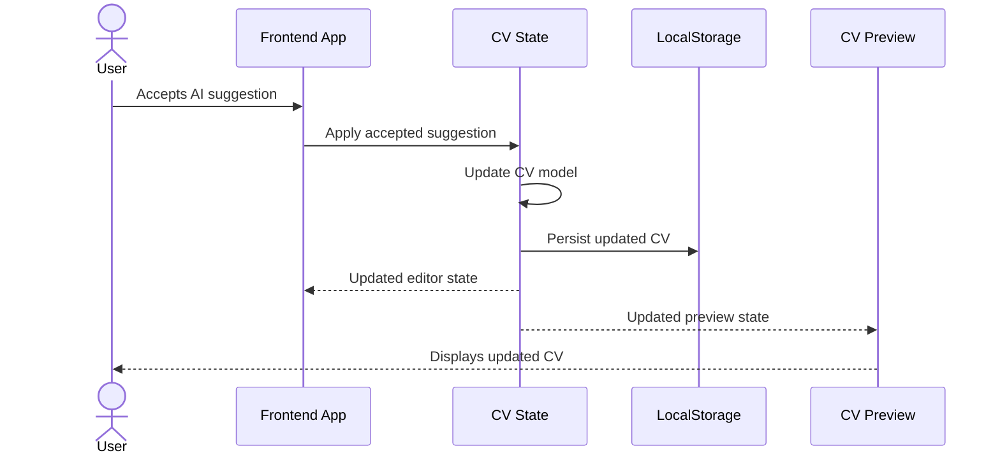
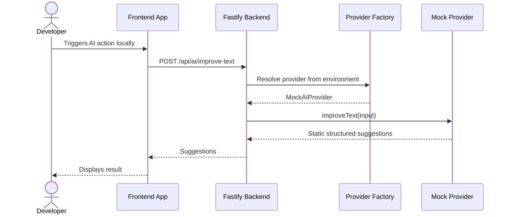
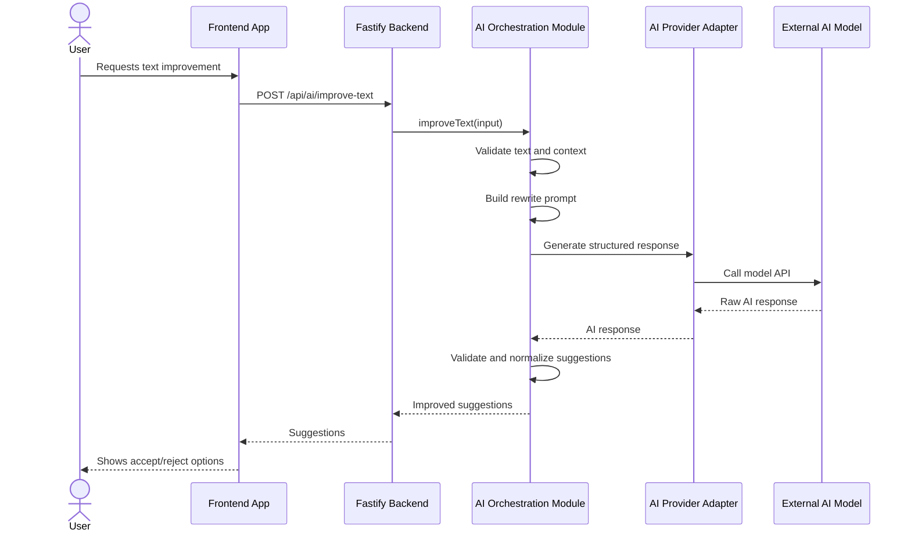

# CV Builder AI Architecture Proposal

## 1. Goal

The goal is to add AI capabilities to the CV Builder in a controlled, scalable, and maintainable way.

The AI feature should help users improve their CV content without allowing the AI to directly mutate the CV automatically. The user should always review and accept suggestions before changes are applied.

This architecture is designed for an MVP first, but keeps the codebase ready to evolve into a more complete product later.

---

## 2. Product Direction

The AI assistant should not start as a generic chatbot.

Instead, the first version should focus on task-based AI actions that solve specific CV problems.

### Initial AI capabilities

1. Generate experience bullet points
2. Improve or rewrite existing text
3. Analyze CV quality
4. Match CV content against a job description later

### Product principle

```txt
AI suggests → user reviews → user accepts or rejects
```

This keeps the user in control and avoids unexpected modifications.

---

## 3. High-Level Architecture

For the current stage of the project, the recommended setup is:

```txt
1 React/Vite frontend
1 Fastify backend
AI orchestration as internal backend modules
Provider adapters as internal backend modules
```

We do not need multiple backend services yet.

The orchestration layer and provider adapters are logical code boundaries, not separate deployed services.

---

## 4. Main Technologies

### Frontend

- React
- TypeScript
- Vite
- Existing CV state architecture
- Existing CV editor and preview flow
- LocalStorage persistence for now
- Future: user accounts and database persistence

### Backend

- Node.js
- Fastify
- TypeScript
- Zod for request and response validation
- Environment-based AI provider selection

### AI Providers

Initial provider strategy:

- Mock Provider for local development
- Gemini Provider for real AI integration
- Future providers: Groq, OpenAI, Anthropic, or others

### Shared Package

Recommended:

- Shared TypeScript types
- Shared Zod schemas
- Shared AI request/response contracts

---

## 5. Architecture Diagram



---

## 6. Recommended Repository Structure

A clean structure could look like this:

```txt
cv-builder/
  apps/
    web/
      src/
        features/
          ai-assistant/
            components/
            hooks/
            api/
            types/
        core/
        features/
        shared/

    api/
      src/
        server.ts
        app.ts

        routes/
          ai.routes.ts
          health.routes.ts

        modules/
          ai/
            ai.service.ts
            ai.types.ts

            use-cases/
              generate-experience-bullets.ts
              improve-text.ts
              analyze-cv.ts
              match-job-description.ts

            prompts/
              generate-experience-bullets.prompt.ts
              improve-text.prompt.ts
              analyze-cv.prompt.ts

            providers/
              ai-provider.ts
              mock.provider.ts
              gemini.provider.ts

            validators/
              ai.schemas.ts

            normalizers/
              normalize-ai-response.ts

        config/
          env.ts

  packages/
    shared/
      src/
        ai/
          ai.contracts.ts
          ai.schemas.ts
        cv/
          cv-model.ts
```

For now, if the project is not a monorepo yet, this can be simplified:

```txt
client/
server/
shared/
```

---

## 7. Backend Module Responsibilities

### API Routes

Responsible for:

- Receiving frontend requests
- Validating input
- Calling the correct AI use case
- Returning structured responses

Example routes:

```txt
POST /api/ai/generate-experience-bullets
POST /api/ai/improve-text
POST /api/ai/analyze-cv
POST /api/ai/match-job-description
```

### AI Service / Orchestration Module

Responsible for:

- Selecting the correct use case
- Building prompts
- Validating input
- Calling the provider adapter
- Validating AI output
- Normalizing responses into frontend-safe structures

This layer protects the frontend from provider-specific details.

### Prompt Builders

Responsible for transforming application context into AI instructions.

Example input:

```txt
Role
Company
Technologies
Existing bullet
Target seniority
Desired tone
```

Prompts should be versioned and kept out of React components.

### Provider Adapters

Responsible for calling a specific AI provider.

All providers should implement the same interface.

Example:

```ts
export interface AIProvider {
  generateStructuredResponse<TInput, TOutput>(
    input: TInput
  ): Promise<TOutput>;
}
```

Possible providers:

```txt
MockAIProvider
GeminiAIProvider
GroqAIProvider
OpenAIProvider
```

The rest of the backend should not care which provider is currently being used.

---

## 8. Mock Provider

The Mock Provider is a fake AI provider.

It does not call any real AI model.

It returns static or rule-based responses so the frontend and backend flows can be built before using a real AI API.

### Why it is useful

- No API key needed
- No cost
- No rate limits
- Deterministic responses for testing
- Allows building the UI first
- Makes local development easier

Example:

```ts
export class MockAIProvider implements AIProvider {
  async generateExperienceBullets(input: GenerateExperienceBulletsInput) {
    return {
      suggestions: [
        {
          text: `Built reusable ${input.technology ?? "frontend"} components for ${input.role}.`,
          reason: "Mock suggestion used for local development.",
        },
      ],
    };
  }
}
```

Environment example:

```env
AI_PROVIDER=mock
```

Later:

```env
AI_PROVIDER=gemini
```

---

## 9. Sequence Diagram: Generate Experience Bullets



---

## 10. Sequence Diagram: Accept AI Suggestion



---

## 11. Sequence Diagram: Mock Provider Flow



---

## 12. Sequence Diagram: Improve Existing Text



---

## 13. Why Fastify Instead of Express or NestJS

### Fastify

Recommended for this project.

Benefits:

- Lightweight
- Fast
- Good TypeScript support
- Great for API services
- Easy to structure cleanly
- Less boilerplate than NestJS
- More structured than plain Express

### Express

Good option, but more manual.

Potential downsides:

- Less structure by default
- Validation and typing need more setup
- Easy to grow messy if conventions are not enforced

### NestJS

Powerful but probably too heavy for this stage.

Potential downsides:

- More boilerplate
- More framework concepts
- Slower iteration for a small AI backend
- Better suited for larger enterprise backends

### Decision

```txt
Use Fastify + TypeScript + Zod for V1.
```

---

## 14. Suggested API Contracts

### Generate Experience Bullets Request

```ts
export type GenerateExperienceBulletsRequest = {
  role: string;
  company?: string;
  seniority?: string;
  technologies?: string[];
  responsibilities?: string;
  targetRole?: string;
  tone?: "professional" | "concise" | "impactful";
};
```

### Generate Experience Bullets Response

```ts
export type GenerateExperienceBulletsResponse = {
  suggestions: Array<{
    text: string;
    reason?: string;
  }>;
};
```

### Improve Text Request

```ts
export type ImproveTextRequest = {
  text: string;
  section: "summary" | "experience" | "project" | "education" | "skills";
  tone?: "professional" | "concise" | "impactful";
  targetRole?: string;
};
```

### Improve Text Response

```ts
export type ImproveTextResponse = {
  suggestions: Array<{
    text: string;
    reason?: string;
  }>;
};
```

### Analyze CV Request

```ts
export type AnalyzeCvRequest = {
  cv: CvModel;
  targetRole?: string;
};
```

### Analyze CV Response

```ts
export type AnalyzeCvResponse = {
  score: number;
  strengths: string[];
  improvements: Array<{
    section: string;
    message: string;
    priority: "low" | "medium" | "high";
  }>;
};
```

---

## 15. Important Validation Rules

The backend should validate:

- Required fields
- Maximum text length
- Valid section names
- Valid tone values
- AI output structure
- Number of suggestions
- Empty or low-quality responses

The frontend should never trust raw AI responses.

---

## 16. Important Security and Cost Controls

Even for an MVP, the backend should prepare for:

- Environment variables for API keys
- No AI keys in the frontend
- Request size limits
- Rate limiting
- Basic logging
- Provider timeout handling
- Error fallback messages
- Optional usage tracking

Possible future controls:

- User-level quotas
- Paid plan limits
- Monthly token limits
- AI usage dashboard

---

## 17. Error Handling Strategy

The frontend should handle these states:

```txt
idle
loading
success
empty
error
```

Backend errors should be mapped into user-friendly messages.

Example:

```txt
We could not generate suggestions right now. Please try again.
```

Avoid exposing provider errors directly to users.

---

## 18. UX Rules for AI Suggestions

AI suggestions should be:

- Reviewable
- Editable
- Acceptable
- Rejectable
- Regenerable

The AI should not automatically overwrite user content.

Recommended actions:

```txt
Accept
Reject
Regenerate
Copy
Edit before applying
```

---

## 19. Recommended MVP Implementation Order

### Phase 1: Backend foundation

- Add Fastify backend
- Add health route
- Add AI routes
- Add Zod validation
- Add MockAIProvider

### Phase 2: Frontend AI UX

- Add AI assistant feature folder
- Add API client
- Add loading/error states
- Show suggestions
- Allow accepting suggestions into CV state

### Phase 3: Real AI provider

- Add Gemini provider
- Add environment configuration
- Add provider factory
- Add real prompt builders
- Add response normalization

### Phase 4: Product expansion

- Add CV analysis
- Add job description matching
- Add usage limits
- Add analytics
- Add user accounts and persistence later

---

## 20. Key Architectural Decision

The most important decision is this:

```txt
The frontend owns the user experience.
The backend owns AI execution, prompt logic, provider selection, validation, and normalization.
The AI provider is replaceable.
The user owns the final CV changes.
```

This keeps the product clean, safe, and scalable.
