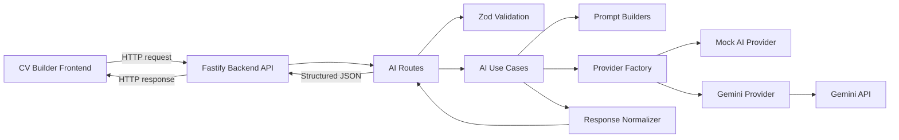

# EPIC: AI Backend for CV Builder — Senior Execution Plan

## 1. Epic Summary

Build a standalone backend service for the CV Builder AI features.

The backend will expose safe, structured AI endpoints that the frontend can consume to help users:
- generate CV experience bullet points
- improve existing CV text
- receive structured CV quality feedback in later phases

This EPIC focuses only on the backend.

The frontend will be handled in a separate EPIC.

---

## 2. Architecture Decision

We will use a separate backend repository.

```txt
cv-builder-web
  React / Vite frontend
  deployed to Vercel

cv-builder-api
  Fastify / TypeScript backend
  deployed independently
```

The backend is the source of truth for:
- AI contracts
- request validation
- prompt building
- provider selection
- AI response normalization
- error handling
- future usage limits

The frontend can duplicate small DTO types temporarily, but it should treat the backend API as the contract source of truth.

---

## 3. Main Technologies

### Backend

- Node.js
- TypeScript
- Fastify
- Zod
- dotenv
- pnpm or npm
- Vitest for tests

### AI Provider Strategy

Initial providers:

```txt
MockAIProvider
GeminiAIProvider
```

Future providers:

```txt
GroqProvider
OpenAIProvider
AnthropicProvider
```

Provider selection will be controlled by environment variables.

Example:

```env
AI_PROVIDER=mock
GEMINI_API_KEY=
PORT=4000
NODE_ENV=development
```

---

## 4. High-Level Architecture



---

## 5. Core Backend Principles

1. Routes stay thin.
2. Use cases own the flow.
3. Prompt builders only build prompts.
4. Providers only call AI models or return mock data.
5. Normalizers protect the frontend from raw AI output.
6. Zod validates both incoming requests and outgoing AI-shaped data.
7. No raw provider error should be returned to the frontend.
8. No API key should ever exist in the frontend.
9. The backend should be easy to test with `AI_PROVIDER=mock`.
10. Start simple, but keep module boundaries clean.

---

## 6. Proposed Folder Structure

```txt
src/
  app.ts
  server.ts

  config/
    env.ts

  routes/
    health.routes.ts
    ai.routes.ts

  modules/
    ai/
      ai.types.ts
      ai.errors.ts
      ai.service.ts

      use-cases/
        generate-experience-bullets.use-case.ts
        improve-text.use-case.ts
        analyze-cv.use-case.ts

      prompts/
        generate-experience-bullets.prompt.ts
        improve-text.prompt.ts
        analyze-cv.prompt.ts

      providers/
        ai-provider.ts
        provider-factory.ts
        mock.provider.ts
        gemini.provider.ts

      validators/
        ai.schemas.ts

      normalizers/
        normalize-suggestions.ts
        normalize-analysis.ts

  shared/
    http/
      errors.ts
      response.ts
```

---

# Phase 1 — Backend Foundation

---

## Ticket 1 — Initialize Fastify Backend

### Description

As a developer, I want to initialize a standalone Fastify backend using TypeScript so that the CV Builder can have a secure backend service for future AI features.

### Scope

This ticket creates the backend foundation only.

It should not implement AI logic yet.

### Acceptance Criteria

- A standalone Fastify backend project is created.
- TypeScript is configured.
- The app can run locally.
- A `/health` endpoint returns:

```json
{
  "status": "ok"
}
```

- Environment variables are loaded from `.env`.
- Project has a clean structure:

```txt
src/
  app.ts
  server.ts
  config/
  routes/
  modules/
```

- Basic centralized error handling exists.
- README includes local setup instructions.

### Out of Scope

- AI endpoints
- AI providers
- Gemini integration
- Frontend integration

### Suggested Tests

- Health endpoint returns HTTP 200.
- Server bootstraps without throwing.
- Missing optional env vars do not crash the app.

### Claude Prompt

```txt
You are a senior backend engineer helping me create the backend service for a CV Builder AI product.

Create a standalone Fastify backend using TypeScript.

Context:
- This backend will later expose AI endpoints for a CV Builder.
- For this ticket, only create the backend foundation.
- Do not implement AI logic yet.

Requirements:
1. Create a clean Fastify app structure:
   src/
     app.ts
     server.ts
     config/
       env.ts
     routes/
       health.routes.ts
     modules/

2. Add a GET /health endpoint returning:
   { "status": "ok" }

3. Add environment variable support using dotenv.

4. Add a typed env config module.
   The config should support:
   - PORT
   - NODE_ENV

5. Add basic centralized error handling.
   Do not leak internal error details in production.

6. Add scripts:
   - dev
   - build
   - start
   - test

7. Add a README with:
   - installation steps
   - local development command
   - required env vars
   - health endpoint example

8. Use TypeScript strict mode.

9. Keep the implementation simple and production-minded.

Constraints:
- Do not add AI routes yet.
- Do not add database logic.
- Do not add authentication.
- Do not overengineer with unnecessary abstractions.

Expected output:
- Working Fastify backend
- Clean folder structure
- Health endpoint
- Env config
- Basic error handling
- README
```

---

## Ticket 2 — Add AI Module Skeleton and Core Types

### Description

As a developer, I want to create the AI module skeleton so that all future AI logic has clear boundaries.

### Scope

This ticket introduces module structure, shared AI types, and provider interfaces.

It should not call real AI providers yet.

### Acceptance Criteria

- `modules/ai` folder exists.
- AI module has clear internal folders:
  - `providers`
  - `prompts`
  - `use-cases`
  - `validators`
  - `normalizers`
- Core request/response types are defined.
- `AIProvider` interface exists.
- Initial use cases are represented in types:
  - generate experience bullets
  - improve text
  - analyze CV later

### Out of Scope

- Routes
- Real provider implementation
- Prompt implementation
- Gemini API calls

### Suggested Tests

- TypeScript compiles.
- Provider interface can be implemented by a fake test provider.

### Claude Prompt

```txt
You are a senior software architect.

Add the AI module skeleton to the existing Fastify backend.

Context:
- The backend will power AI features for a CV Builder.
- The backend is the source of truth for AI contracts.
- The frontend will consume structured JSON responses.
- We need clean boundaries before implementing behavior.

Requirements:
1. Create this module structure:

src/modules/ai/
  ai.types.ts
  ai.errors.ts
  ai.service.ts

  use-cases/
    generate-experience-bullets.use-case.ts
    improve-text.use-case.ts
    analyze-cv.use-case.ts

  prompts/
    generate-experience-bullets.prompt.ts
    improve-text.prompt.ts
    analyze-cv.prompt.ts

  providers/
    ai-provider.ts
    provider-factory.ts
    mock.provider.ts
    gemini.provider.ts

  validators/
    ai.schemas.ts

  normalizers/
    normalize-suggestions.ts
    normalize-analysis.ts

2. Define core types for:
   - GenerateExperienceBulletsInput
   - GenerateExperienceBulletsResult
   - ImproveTextInput
   - ImproveTextResult
   - AnalyzeCvInput
   - AnalyzeCvResult
   - AiSuggestion

3. Define an AIProvider interface that supports:
   - generateExperienceBullets(input)
   - improveText(input)
   - analyzeCv(input)

4. Keep placeholder files minimal but useful.
   Do not implement real AI behavior yet.

5. Use strong TypeScript types.
   Avoid `any`.

6. Add comments only where they clarify architectural intent.

Constraints:
- Do not add routes yet.
- Do not call Gemini.
- Do not implement prompts yet.
- Do not introduce database/auth logic.

Expected output:
- AI module folder structure
- Core AI types
- AIProvider interface
- Placeholder files that compile cleanly
```

---

## Ticket 3 — Add Zod Validation Schemas

### Description

As a developer, I want request and response validation schemas so that the backend can validate user input and AI-shaped output safely.

### Acceptance Criteria

- Zod schemas exist for:
  - generate experience bullets request
  - improve text request
  - analyze CV request placeholder
  - suggestion response
  - analysis response placeholder
- Types are inferred from Zod where appropriate.
- Input constraints exist for string length and enum values.
- Invalid requests can be safely rejected.

### Suggested Validation Rules

For generate experience bullets:
- `role` required
- `role` max 120 chars
- `company` optional, max 120 chars
- `technologies` optional, max 20 items
- `responsibilities` optional, max 2000 chars
- `tone` enum

For improve text:
- `text` required, max 3000 chars
- `section` enum
- `tone` enum
- `targetRole` optional

### Claude Prompt

```txt
You are a senior TypeScript backend engineer.

Add Zod validation schemas for the AI module.

Context:
- This backend will receive AI requests from a CV Builder frontend.
- The backend must validate incoming requests and also validate AI-shaped output before returning it.
- We want strict, safe, reusable schemas.

Requirements:
1. In src/modules/ai/validators/ai.schemas.ts, define Zod schemas for:

GenerateExperienceBulletsRequest:
- role: required string, min 1, max 120
- company: optional string, max 120
- seniority: optional string, max 80
- technologies: optional array of strings, max 20 items, each max 60
- responsibilities: optional string, max 2000
- targetRole: optional string, max 120
- tone: optional enum: "professional" | "concise" | "impactful"

ImproveTextRequest:
- text: required string, min 1, max 3000
- section: enum: "summary" | "experience" | "project" | "education" | "skills"
- tone: optional enum: "professional" | "concise" | "impactful"
- targetRole: optional string, max 120

AiSuggestion:
- text: required string, min 1, max 600
- reason: optional string, max 400

SuggestionsResponse:
- suggestions: array of AiSuggestion, min 1, max 5

AnalyzeCvRequest:
- cv: unknown for now or a minimal object schema if CvModel does not exist yet
- targetRole: optional string, max 120

AnalyzeCvResponse:
- score: number between 0 and 100
- strengths: array of strings, max 10 items
- improvements: array of objects with:
  - section: string
  - message: string
  - priority: "low" | "medium" | "high"

2. Export inferred TypeScript types from the schemas.

3. Avoid duplicated enum definitions where possible.

4. Ensure schemas are reusable by routes, use cases, and normalizers.

Constraints:
- Do not create routes yet.
- Do not call AI providers.
- Do not loosen validation with any unless unavoidable.
- Keep schemas readable.

Expected output:
- Strong Zod schemas
- Inferred TypeScript types
- Compilation passes
```

---

## Ticket 4 — Implement Mock AI Provider

### Description

As a developer, I want a mock AI provider so that the backend can be tested and integrated without calling a real AI model.

### Acceptance Criteria

- `MockAIProvider` implements `AIProvider`.
- Mock responses are deterministic.
- Mock responses are realistic enough for frontend integration.
- No external API calls happen.
- Mock provider supports:
  - generate experience bullets
  - improve text
  - analyze CV placeholder

### Suggested Tests

- Mock provider returns suggestions.
- Mock provider returns deterministic output for the same input.
- Mock provider implements the provider interface.

### Claude Prompt

```txt
You are a senior backend engineer.

Implement a MockAIProvider for the AI module.

Context:
- We need to build and test the AI backend without calling a real model.
- The mock provider should return deterministic, realistic CV-related responses.
- This provider will be used locally with AI_PROVIDER=mock.

Requirements:
1. Implement src/modules/ai/providers/mock.provider.ts.

2. The class must implement the AIProvider interface.

3. Implement:
   - generateExperienceBullets(input)
   - improveText(input)
   - analyzeCv(input)

4. generateExperienceBullets should return 3 realistic bullet suggestions.
   Each suggestion should include:
   - text
   - reason

5. improveText should return 2 or 3 rewritten suggestions.
   Each suggestion should include:
   - text
   - reason

6. analyzeCv can return a deterministic placeholder analysis:
   - score
   - strengths
   - improvements

7. Do not call any external services.

8. Avoid random output.
   Deterministic responses are better for tests and frontend development.

9. Keep responses realistic for a professional CV Builder.

Constraints:
- Do not implement Gemini here.
- Do not put prompt logic inside the mock provider unless needed for simple mock text.
- Avoid overengineering.

Expected output:
- Working MockAIProvider
- Strong TypeScript typing
- Useful deterministic mock responses
```

---

## Ticket 5 — Implement Provider Factory

### Description

As a developer, I want a provider factory so that the backend can switch AI providers using environment configuration.

### Acceptance Criteria

- Provider factory reads `AI_PROVIDER`.
- Supports:
  - `mock`
  - `gemini`
- Defaults to mock in local development.
- Throws a safe configuration error for unsupported providers.
- No provider-selection conditionals are spread across use cases or routes.

### Claude Prompt

```txt
You are a senior backend engineer.

Implement an AI provider factory.

Context:
- The AI backend must support multiple providers over time.
- The first provider is MockAIProvider.
- GeminiProvider will be added later or may exist as a placeholder.
- Use cases should not know which provider is active.

Requirements:
1. Implement src/modules/ai/providers/provider-factory.ts.

2. Read the active provider from env:
   AI_PROVIDER

3. Supported values:
   - "mock"
   - "gemini"

4. If AI_PROVIDER is missing in development, default to "mock".

5. If AI_PROVIDER is invalid, throw a typed configuration error.

6. Return an implementation of AIProvider.

7. Keep provider selection centralized.
   Do not spread provider selection logic in routes or use cases.

8. If GeminiProvider is not implemented yet, create a placeholder that throws a clear "not implemented" provider error.

Constraints:
- Do not call any real AI API in this ticket.
- Do not implement route logic.
- Do not introduce a dependency injection framework.

Expected output:
- Provider factory
- Centralized provider selection
- Safe handling of invalid provider config
```

---

# Phase 2 — AI Use Cases and API Routes  -- I am here

---

## Ticket 6 — Implement Response Normalizer for Suggestions

### Description

As a developer, I want AI suggestion responses to be normalized so that the frontend always receives safe, predictable data.

### Acceptance Criteria

- Normalizer accepts unknown/provider-shaped output.
- Normalizer returns:

```ts
{
  suggestions: Array<{
    text: string;
    reason?: string;
  }>
}
```

- Empty, invalid, or too-long suggestions are removed.
- Result is limited to 5 suggestions.
- Normalized output is validated with Zod.
- If no valid suggestions remain, a domain error is thrown.

### Claude Prompt

```txt
You are a senior backend engineer.

Implement a response normalizer for AI suggestions.

Context:
- AI providers may return imperfect output.
- The frontend must never receive raw or invalid AI output.
- The backend must normalize and validate suggestion responses.

Requirements:
1. Implement src/modules/ai/normalizers/normalize-suggestions.ts.

2. The normalizer should accept provider output and return:
   {
     suggestions: [
       { text: string, reason?: string }
     ]
   }

3. It should:
   - trim whitespace
   - remove empty suggestions
   - remove suggestions without valid text
   - limit results to 5 suggestions
   - limit text length according to the Zod schema
   - preserve valid reason values
   - remove invalid reason values

4. Validate the final result using the SuggestionsResponse Zod schema.

5. If no valid suggestions remain, throw a typed AI normalization error.

6. Keep the function pure and easy to test.

Constraints:
- Do not call AI providers.
- Do not implement routes.
- Do not hide validation failures silently if the entire response is invalid.

Expected output:
- Pure normalizer function
- Strong types
- Safe output shape
- Testable implementation
```

---

## Ticket 7 — Implement Generate Experience Bullets Use Case

### Description

As a developer, I want a use case that generates experience bullet suggestions from structured user input.

### Acceptance Criteria

- Input is validated.
- Prompt is built in a dedicated prompt builder.
- Provider is called through `AIProvider`.
- Output is normalized.
- Use case returns structured suggestions only.

### Claude Prompt

```txt
You are a senior backend engineer.

Implement the generateExperienceBullets use case.

Context:
- This use case powers the CV Builder feature where users ask AI to generate professional experience bullet points.
- The use case must not know if the active provider is mock, Gemini, or something else.
- Routes should remain thin.

Requirements:
1. Implement src/modules/ai/use-cases/generate-experience-bullets.use-case.ts.

2. Flow:
   a. Validate input using GenerateExperienceBulletsRequest schema.
   b. Build the prompt using a dedicated prompt builder.
   c. Call provider.generateExperienceBullets(validInput).
   d. Normalize the provider response using normalizeSuggestions.
   e. Return the normalized response.

3. Keep the use case independent from Fastify request/response objects.

4. Accept dependencies explicitly:
   - AIProvider
   - optionally prompt builder or normalizer if useful

5. Return only structured data:
   {
     suggestions: [{ text, reason }]
   }

6. Add focused unit tests using MockAIProvider or a small fake provider.

Constraints:
- Do not put prompt text directly in the route.
- Do not call Gemini directly.
- Do not mutate input.
- Do not return raw AI output.

Expected output:
- Generate experience bullets use case
- Strong typing
- Unit tests
- Clean dependency boundaries
```

---

## Ticket 8 — Implement Improve Text Use Case

### Description

As a developer, I want a use case that improves existing CV text based on a section and tone.

### Acceptance Criteria

- Input is validated.
- Prompt is built in dedicated prompt builder.
- Provider is called through `AIProvider`.
- Output is normalized.
- Supports sections:
  - summary
  - experience
  - project
  - education
  - skills

### Claude Prompt

```txt
You are a senior backend engineer.

Implement the improveText use case.

Context:
- This use case powers the CV Builder feature where users improve existing text.
- It should support different CV sections and tones.
- The use case must stay provider-agnostic.

Requirements:
1. Implement src/modules/ai/use-cases/improve-text.use-case.ts.

2. Flow:
   a. Validate input using ImproveTextRequest schema.
   b. Build the prompt using improveText prompt builder.
   c. Call provider.improveText(validInput).
   d. Normalize the provider response using normalizeSuggestions.
   e. Return the normalized response.

3. Keep the use case independent from Fastify request/response objects.

4. Add unit tests for:
   - valid input
   - invalid input
   - provider returning invalid suggestions
   - successful normalized response

5. Return only:
   {
     suggestions: [{ text, reason }]
   }

Constraints:
- Do not call real AI providers here.
- Do not return raw provider output.
- Do not place prompt strings in route handlers.
- Do not mutate input.

Expected output:
- Improve text use case
- Strong typing
- Unit tests
- Clean separation of concerns
```

---

## Ticket 9 — Implement Prompt Builders

### Description

As a developer, I want dedicated prompt builders so that AI instructions are isolated, versionable, and reusable.

### Acceptance Criteria

- Prompt builder exists for:
  - generate experience bullets
  - improve text
- Prompt builders return a structured prompt object or string.
- Prompts require JSON output.
- Prompts include clear constraints.
- Prompt logic is not inside routes or providers.

### Prompt Engineering Requirements

Prompts should instruct the model to:
- return JSON only
- avoid markdown
- avoid invented metrics unless explicitly marked as optional suggestions
- keep bullets concise
- use action verbs
- focus on impact
- avoid first-person wording
- preserve truthfulness
- produce ATS-friendly content

### Claude Prompt

```txt
You are a senior AI product engineer and backend engineer.

Implement prompt builders for the CV Builder AI backend.

Context:
- Prompt builders should be isolated from routes, providers, and use cases.
- The backend expects structured JSON responses.
- These prompts will later be used by real AI providers like Gemini.
- The prompts must prioritize professional, truthful, ATS-friendly CV content.

Files:
- src/modules/ai/prompts/generate-experience-bullets.prompt.ts
- src/modules/ai/prompts/improve-text.prompt.ts

Requirements:
1. Implement a prompt builder for generateExperienceBullets.

The prompt should instruct the AI to:
- generate 3 to 5 CV bullet suggestions
- use strong action verbs
- keep each bullet concise
- avoid first person
- avoid exaggeration
- avoid inventing exact metrics unless the input provides metrics
- if suggesting measurable impact, phrase it generically unless numbers are provided
- tailor suggestions to role, seniority, technologies, responsibilities, and targetRole
- return JSON only

Expected JSON shape:
{
  "suggestions": [
    {
      "text": "string",
      "reason": "string"
    }
  ]
}

2. Implement a prompt builder for improveText.

The prompt should instruct the AI to:
- rewrite the provided text for clarity, impact, and professional tone
- preserve the original meaning
- avoid adding false claims
- adapt to the CV section
- respect the requested tone
- return 2 to 3 alternatives
- return JSON only

Expected JSON shape:
{
  "suggestions": [
    {
      "text": "string",
      "reason": "string"
    }
  ]
}

3. Include clear output constraints:
- No markdown
- No explanation outside JSON
- No code fences
- Valid JSON only
- Max 5 suggestions

4. Keep prompt builders deterministic and easy to test.
   They should be pure functions.

5. Add unit tests that verify the prompt includes:
- JSON-only instruction
- no invented metrics instruction
- role/context fields when provided

Constraints:
- Do not call AI providers.
- Do not parse AI responses here.
- Do not put prompt logic in use cases.
- Avoid excessive prompt complexity.

Expected output:
- Pure prompt builder functions
- Prompt tests
- Strongly typed prompt inputs
```

---

## Ticket 10 — Implement AI Routes

### Description

As a developer, I want Fastify routes for the initial AI endpoints so that the frontend can request AI suggestions.

### Acceptance Criteria

Routes exist:

```txt
POST /api/ai/generate-experience-bullets
POST /api/ai/improve-text
```

Each route:
- validates body
- calls the correct use case
- returns normalized JSON
- maps errors to safe HTTP responses
- keeps implementation thin

### Suggested Response Format

Success:

```json
{
  "suggestions": [
    {
      "text": "Built reusable React components...",
      "reason": "Improves clarity and impact."
    }
  ]
}
```

Validation error:

```json
{
  "error": {
    "code": "VALIDATION_ERROR",
    "message": "Invalid request payload."
  }
}
```

AI error:

```json
{
  "error": {
    "code": "AI_GENERATION_FAILED",
    "message": "We couldn't generate suggestions. Please try again."
  }
}
```

### Claude Prompt

```txt
You are a senior backend engineer.

Implement the initial AI routes for the Fastify backend.

Context:
- The AI module already has schemas, providers, prompt builders, normalizers, and use cases.
- Routes should be thin.
- Routes should not contain business logic or prompt logic.
- The frontend will call these endpoints.

Endpoints:
1. POST /api/ai/generate-experience-bullets
2. POST /api/ai/improve-text

Requirements:
1. Create or update src/routes/ai.routes.ts.

2. Register the routes in app.ts.

3. For each endpoint:
   - Validate request body with the corresponding Zod schema.
   - Resolve the active AI provider through the provider factory.
   - Call the corresponding use case.
   - Return the normalized result.

4. Use consistent error responses:
   {
     error: {
       code: string,
       message: string
     }
   }

5. Validation errors should return HTTP 400.

6. AI/provider/normalization errors should return a safe HTTP status and safe message.

7. Do not leak raw provider errors.

8. Add integration tests for:
   - health endpoint still works
   - generate bullets success with mock provider
   - improve text success with mock provider
   - validation error case

Constraints:
- Do not implement frontend logic.
- Do not call Gemini directly in routes.
- Do not put prompt strings inside routes.
- Keep route handlers small and readable.

Expected output:
- AI routes
- Registered route module
- Safe error handling
- Integration tests
```

---

# Phase 3 — Real AI Provider

---

## Ticket 11 — Implement Gemini Provider

### Description

As a developer, I want to integrate Gemini as the first real AI provider so that the backend can generate real AI suggestions.

### Acceptance Criteria

- Gemini provider implements `AIProvider`.
- API key is read from env.
- Provider calls Gemini API.
- Provider requests structured JSON.
- Provider handles:
  - missing API key
  - timeout
  - invalid response
  - provider error
- Provider returns data that can be normalized by backend normalizers.
- `AI_PROVIDER=gemini` activates Gemini provider.

### Claude Prompt

```txt
You are a senior backend engineer with experience integrating AI providers.

Implement GeminiProvider for the AI backend.

Context:
- The backend already has AIProvider interface, provider factory, prompt builders, use cases, and normalizers.
- GeminiProvider should be swappable with MockAIProvider.
- The provider should not contain business rules that belong in use cases.
- The provider should focus on calling Gemini and returning provider-shaped output.

Requirements:
1. Implement src/modules/ai/providers/gemini.provider.ts.

2. GeminiProvider must implement AIProvider.

3. Read API key from env:
   GEMINI_API_KEY

4. If AI_PROVIDER=gemini and GEMINI_API_KEY is missing, throw a clear configuration error during provider creation.

5. Use the official Gemini API SDK or a clean fetch-based implementation.

6. Add timeout handling.
   Use a reasonable default timeout, for example 20 seconds.

7. Ensure Gemini is instructed to return JSON only.
   Use the prompt output constraints already generated by prompt builders.

8. Implement:
   - generateExperienceBullets(input)
   - improveText(input)
   - analyzeCv(input), even if it is initially a placeholder or basic implementation

9. Parse the model response safely.
   If JSON parsing fails, throw a provider error that can be mapped by the global error handler.

10. Do not return raw SDK objects to the use cases.

11. Add tests using mocked Gemini responses.
   Do not call the real Gemini API in tests.

Constraints:
- Do not put CV business rules in GeminiProvider.
- Do not expose API key.
- Do not leak raw provider errors to HTTP responses.
- Do not skip normalization in use cases.
- Do not make real network calls in tests.

Expected output:
- Working GeminiProvider
- Provider factory supports AI_PROVIDER=gemini
- Safe provider errors
- Tests with mocked responses
```

---

## Ticket 12 — Add Provider Error Handling and Observability

### Description

As a developer, I want clear provider-level error handling and basic observability so that AI failures can be debugged safely.

### Acceptance Criteria

- Custom AI errors exist:
  - validation error
  - provider error
  - normalization error
  - configuration error
- Errors are mapped to safe HTTP responses.
- Internal logs include useful context.
- Logs do not include secrets.
- Failed AI calls are traceable by endpoint/use case.

### Claude Prompt

```txt
You are a senior backend engineer.

Improve AI backend error handling and basic observability.

Context:
- The backend has AI use cases and providers.
- We need safe user-facing errors and useful internal logs.
- We must not leak provider details, prompts, secrets, or raw stack traces to clients.

Requirements:
1. Add custom AI error classes or typed error objects for:
   - AI_VALIDATION_ERROR
   - AI_PROVIDER_ERROR
   - AI_NORMALIZATION_ERROR
   - AI_CONFIGURATION_ERROR
   - AI_GENERATION_FAILED

2. Update centralized error handling to map errors to safe HTTP responses.

3. Add internal logging for:
   - endpoint name
   - use case name
   - provider name
   - failure type
   - request id if available

4. Ensure logs do not include:
   - API keys
   - full raw prompts
   - full user CV content
   - raw provider stack traces in production

5. Add tests for error mapping.

6. Keep error response format consistent:
   {
     error: {
       code: string,
       message: string
     }
   }

Constraints:
- Do not add a full observability stack yet.
- Do not add database logging.
- Do not expose sensitive input in logs.

Expected output:
- Typed AI errors
- Safe HTTP error mapping
- Basic internal logs
- Error mapping tests
```

---

# Phase 4 — CV Analysis Backend Capability

---

## Ticket 13 — Implement CV Analysis Use Case with Mock Provider

### Description

As a developer, I want a backend use case that analyzes a CV and returns structured feedback.

### Acceptance Criteria

- Analyze CV use case exists.
- Input is validated.
- Mock provider returns deterministic CV feedback.
- Output includes:
  - score
  - strengths
  - improvements
- Response is normalized and validated.
- No frontend work is included.

### Claude Prompt

```txt
You are a senior backend engineer.

Implement the analyzeCv backend use case.

Context:
- This is a backend-only feature for the CV Builder AI assistant.
- It should analyze a CV model and return structured feedback.
- For now, use MockAIProvider support. Real Gemini behavior can be improved later.

Requirements:
1. Implement src/modules/ai/use-cases/analyze-cv.use-case.ts.

2. Input:
   {
     cv: object,
     targetRole?: string
   }

3. Output:
   {
     score: number,
     strengths: string[],
     improvements: [
       {
         section: string,
         message: string,
         priority: "low" | "medium" | "high"
       }
     ]
   }

4. Validate input using AnalyzeCvRequest schema.

5. Call provider.analyzeCv.

6. Normalize and validate output using AnalyzeCvResponse schema.

7. Add or update MockAIProvider.analyzeCv to return realistic deterministic feedback.

8. Add unit tests for:
   - valid analysis
   - invalid input
   - invalid provider output
   - normalized response

Constraints:
- Do not implement frontend UI.
- Do not add database persistence.
- Do not return raw provider output.

Expected output:
- Analyze CV use case
- Mock provider support
- Validation and normalization
- Unit tests
```

---

## Ticket 14 — Add CV Analysis Route

### Description

As a developer, I want an AI route for CV analysis so that the frontend can request structured CV feedback later.

### Acceptance Criteria

- Route exists:

```txt
POST /api/ai/analyze-cv
```

- Request body is validated.
- Analyze CV use case is called.
- Response is structured.
- Errors are safely mapped.

### Claude Prompt

```txt
You are a senior backend engineer.

Add the CV analysis API route.

Context:
- The analyzeCv use case already exists.
- This is backend-only.
- The frontend will consume this endpoint in a separate EPIC.

Endpoint:
POST /api/ai/analyze-cv

Requirements:
1. Add the route to src/routes/ai.routes.ts.

2. Validate request body with AnalyzeCvRequest schema.

3. Resolve provider using provider factory.

4. Call analyzeCv use case.

5. Return:
   {
     score: number,
     strengths: string[],
     improvements: [
       {
         section: string,
         message: string,
         priority: "low" | "medium" | "high"
       }
     ]
   }

6. Use the same error format as other AI endpoints.

7. Add integration tests:
   - success with mock provider
   - validation error
   - provider/normalization error mapping

Constraints:
- Do not implement frontend.
- Do not add auth.
- Do not call provider directly from route except through the use case pattern.
- Keep route thin.

Expected output:
- POST /api/ai/analyze-cv route
- Integration tests
- Consistent error handling
```

---

# Phase 5 — Backend Hardening

---

## Ticket 15 — Add Request Limits, CORS, and Basic Rate Limiting

### Description

As a developer, I want basic API protections so that the backend is safer before frontend integration and deployment.

### Acceptance Criteria

- CORS is configured.
- Request body size limit exists.
- Basic rate limiting exists for AI endpoints.
- Config is environment-driven.
- Local development remains easy.

### Claude Prompt

```txt
You are a senior backend engineer.

Add basic production hardening to the Fastify backend.

Context:
- This backend exposes AI endpoints.
- AI endpoints may become expensive.
- We need basic protection before deployment.
- Keep this lightweight for MVP.

Requirements:
1. Configure CORS.
   Allow origins from env:
   CORS_ORIGIN

2. Add request body size limits.
   Use a reasonable default suitable for CV text input.

3. Add basic rate limiting for /api/ai/* routes.
   Example:
   - max requests per minute per IP
   - configurable via env

4. Ensure local development works with:
   CORS_ORIGIN=http://localhost:5173

5. Add env config for:
   - CORS_ORIGIN
   - RATE_LIMIT_MAX
   - RATE_LIMIT_WINDOW

6. Add tests or documented manual verification steps.

Constraints:
- Do not add authentication yet.
- Do not add billing.
- Do not add database usage tracking.
- Do not make local development painful.

Expected output:
- CORS configured
- Body size limits
- Basic rate limiting
- Env-driven configuration
```

---

## Ticket 16 — Deployment Readiness

### Description

As a developer, I want the backend to be ready for deployment to a service like Render, Railway, or Fly.io.

### Acceptance Criteria

- Production start script exists.
- Health endpoint works.
- `.env.example` exists.
- README has deployment notes.
- Server binds correctly to `PORT`.
- Build command works.
- No local-only assumptions exist.

### Claude Prompt

```txt
You are a senior backend engineer preparing a Fastify TypeScript API for deployment.

Context:
- This is the backend for a CV Builder AI product.
- It will be deployed independently from the frontend.
- The frontend is deployed to Vercel.
- Backend deployment target may be Render, Railway, or Fly.io.

Requirements:
1. Ensure production build works:
   npm run build or pnpm build

2. Ensure production start works:
   npm run start or pnpm start

3. Ensure the server reads PORT from env.

4. Add .env.example with:
   PORT
   NODE_ENV
   AI_PROVIDER
   GEMINI_API_KEY
   CORS_ORIGIN
   RATE_LIMIT_MAX
   RATE_LIMIT_WINDOW

5. Update README with:
   - local setup
   - env vars
   - scripts
   - health check endpoint
   - deployment notes
   - frontend API base URL note

6. Ensure no secrets are committed.

7. Add a basic deployment checklist.

Constraints:
- Do not choose a deployment provider permanently.
- Do not add Docker unless already needed.
- Do not add CI/CD unless requested separately.

Expected output:
- Deployment-ready backend
- Updated env example
- Updated README
- Build/start verified
```

---

# Recommended Implementation Order

```txt
1. Fastify Server Setup
2. AI Module Skeleton and Core Types
3. Zod Validation Schemas
4. Mock AI Provider
5. Provider Factory
6. Response Normalizer
7. Generate Experience Bullets Use Case
8. Improve Text Use Case
9. Prompt Builders
10. AI Routes
11. Error Handling and Observability
12. Gemini Provider
13. CV Analysis Use Case
14. CV Analysis Route
15. Request Limits, CORS, Rate Limiting
16. Deployment Readiness
```

---

# Definition of Done for the EPIC

The EPIC is complete when:

- Backend runs locally.
- Health endpoint works.
- AI endpoints exist.
- Mock provider works.
- Gemini provider can be enabled by env.
- Requests are validated.
- AI output is normalized.
- Errors are safe and consistent.
- Basic tests exist.
- Backend is deployable independently.
- Frontend can consume the API later through HTTP.

---

# Backend API Surface

## GET /health

Response:

```json
{
  "status": "ok"
}
```

---

## POST /api/ai/generate-experience-bullets

Request:

```json
{
  "role": "Senior Frontend Engineer",
  "company": "Example Corp",
  "seniority": "Senior",
  "technologies": ["React", "TypeScript", "GraphQL"],
  "responsibilities": "Built reusable UI components and improved frontend architecture.",
  "targetRole": "Senior Frontend Engineer",
  "tone": "impactful"
}
```

Response:

```json
{
  "suggestions": [
    {
      "text": "Built reusable React and TypeScript components to improve UI consistency and accelerate feature delivery across frontend workflows.",
      "reason": "Highlights technical ownership and product impact."
    }
  ]
}
```

---

## POST /api/ai/improve-text

Request:

```json
{
  "text": "Worked on React components.",
  "section": "experience",
  "tone": "impactful",
  "targetRole": "Senior Frontend Engineer"
}
```

Response:

```json
{
  "suggestions": [
    {
      "text": "Developed reusable React components that improved UI consistency and supported faster delivery of user-facing features.",
      "reason": "Makes the statement more specific, professional, and impact-oriented."
    }
  ]
}
```

---

## POST /api/ai/analyze-cv

Request:

```json
{
  "cv": {},
  "targetRole": "Senior Frontend Engineer"
}
```

Response:

```json
{
  "score": 82,
  "strengths": [
    "Strong technical experience",
    "Clear frontend specialization"
  ],
  "improvements": [
    {
      "section": "experience",
      "message": "Add more measurable outcomes to your bullet points.",
      "priority": "high"
    }
  ]
}
```

---

# Final Architectural Rule

```txt
The backend owns AI behavior.
The frontend owns user interaction.
The provider is replaceable.
The user controls final CV changes.
```
