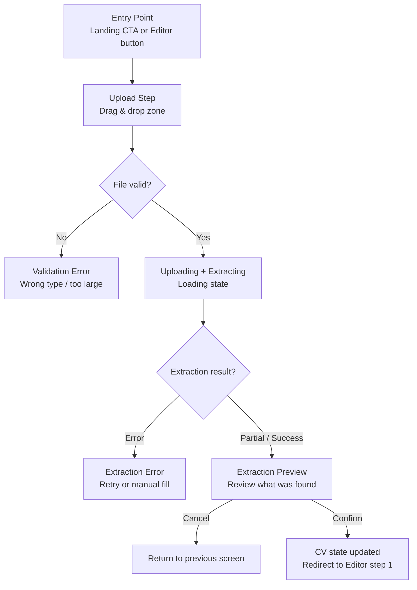

# EPIC: CV Import — Let Users Upload Their Existing CV

## 1. Epic Summary

Allow users to upload an existing CV (PDF or DOCX) and automatically extract their information into the CV Builder.

The goal is to transform the onboarding from:

```txt
Start from scratch → fill every field manually
```

Into:

```txt
Upload existing CV → AI extracts your data → review & confirm → start editing
```

This dramatically reduces time-to-first-value for users who already have a CV and just want to improve it.

---

## 2. Product Goal

Remove the biggest friction point in CV Builder onboarding: the blank form.

Users with an existing CV should be able to:

1. Upload their CV file (PDF or DOCX)
2. See what the AI extracted
3. Confirm the import
4. Land in the editor with their data pre-filled
5. Start improving from a real baseline, not from zero

---

## 3. Core UX Principle

```txt
Upload → Extract → Review → Import → Edit
```

The user is always in control. The AI extracts, not mutates.
The user confirms before any data is written to the CV state.

---

## 4. Reference Design Direction

```txt
----------------------------------------------------
| Entry Point (Landing or Editor)                  |
|  "Already have a CV? Import it →"               |
----------------------------------------------------
         ↓
----------------------------------------------------
| Upload Step                                      |
|  Drag & drop zone                               |
|  Or click to browse                             |
|  Accepted: PDF, DOCX                            |
|  Max size: e.g. 5MB                             |
----------------------------------------------------
         ↓ (uploading + AI extraction)
----------------------------------------------------
| Extraction Preview Step                          |
|  What we found:                                 |
|   ✓ Name, contact                               |
|   ✓ 3 experience entries                        |
|   ✓ Education                                   |
|   ✓ Skills                                      |
|  Warning if data already exists                 |
|  [Import my data] [Cancel]                      |
----------------------------------------------------
         ↓ (on confirm)
----------------------------------------------------
| Editor — pre-filled with imported data          |
----------------------------------------------------
```

---

## 5. Existing Context

The app already has:

- React 19 + TypeScript + Vite
- Tailwind CSS v4
- `CvModel` Zod schema with all CV sections defined
- `CvProvider` + `useCv()` hook with `updateCv`
- Multi-step editor wizard (5 steps)
- AI backend integration for analyze/improve
- i18n support (en/es)
- Landing page with template showcase
- PDF export pipeline

This EPIC adds a new **import flow** that populates `CvModel` from an uploaded file via a new backend endpoint.

---

## 6. Design Principles

1. Never auto-apply extracted data — user always reviews first.
2. The extraction preview must be honest — show what was found, flag what was missing.
3. Warn before overwriting existing data.
4. Support PDF and DOCX only — most common, most parseable.
5. Graceful degradation — partial extractions are OK, show what worked.
6. Keep the upload UI simple — no SDK dependencies if the browser File API is enough.
7. The import flow does not change the selected template or theme.
8. Loading and error states must be clear and actionable.
9. Entry points should feel like an invitation, not a distraction.
10. Backend handles all extraction via AI — frontend just maps the response.

---

## 7. Proposed Layout



---

# Phase 1 — Upload UI

---

## Ticket 1 — Build File Upload Component

### Description

As a user, I want a clear file upload interface so that I can easily provide my existing CV.

### Acceptance Criteria

- Upload zone accepts drag & drop.
- Upload zone accepts click-to-browse (native file picker).
- Accepted file types: `.pdf`, `.docx`.
- Max file size: 5MB (configurable constant).
- Shows file name and size after selection.
- Shows clear error for wrong type or oversized file.
- Upload zone has accessible label and keyboard support.
- Component does not upload — it only handles file selection and validation.

### Claude Prompt

```txt
You are a senior frontend engineer.

Build a file upload component for the CV Import flow.

Context:
- This is a React + TypeScript + Tailwind app.
- The component is purely UI — it handles file selection and validation only.
- Actual upload to the server is handled separately.
- Accepted types: PDF and DOCX only.
- Max size: 5MB.

Create component:
src/features/cv-import/components/CvFileUpload.tsx

Requirements:
1. Render a drop zone:
   - Visual drop target area with dashed border.
   - Drag-over state (highlight the zone).
   - Text: "Drag your CV here or click to browse".
   - Accepted formats reminder: "PDF or DOCX, max 5MB".

2. On file selection (drag or browse):
   - Validate file type (application/pdf, .docx MIME).
   - Validate file size (<= 5MB).
   - If valid: call onFileSelected(file: File).
   - If invalid: show inline error message. Do not call onFileSelected.

3. Props:
   - onFileSelected: (file: File) => void
   - disabled?: boolean

4. After valid file selected:
   - Show file name and size (human readable: "my-cv.pdf · 1.2 MB").
   - Show a "Remove" button to clear selection.

5. Accessible:
   - Use <input type="file"> under the hood (visually hidden).
   - Label the drop zone correctly.
   - Error messages use role="alert".

6. Use existing Tailwind conventions.

Constraints:
- Do not call any API from this component.
- Do not use external file upload libraries unless already in the project.
- Do not handle upload progress — only file selection.
```

---

## Ticket 2 — Build Upload Step Page/Modal

### Description

As a user, I want the import flow to feel guided and focused so that I understand what to do.

### Acceptance Criteria

- Upload step is presented as a focused view (full-page or modal — follow existing patterns).
- Clear title and description explaining what the import does.
- `CvFileUpload` component is embedded.
- "Upload & Extract" action button — disabled until file is selected.
- "Cancel" action returns to the entry point.
- Existing app navigation is not broken.

### Claude Prompt

```txt
You are a senior frontend engineer.

Build the Upload Step for the CV Import flow.

Context:
- The CV Builder has a multi-step editor wizard.
- We are adding a new "import from existing CV" flow.
- The upload step is the first screen the user sees in this flow.
- It should feel like a modal overlay or a focused step — inspect existing patterns.
- The CvFileUpload component handles file selection.

Create component:
src/features/cv-import/components/CvImportUploadStep.tsx

Requirements:
1. Title: "Import your existing CV"
2. Description: Explain that AI will extract data and user will review before it's applied.
3. Embed <CvFileUpload /> for file selection.
4. Show "Upload & Extract" button:
   - Disabled until a valid file is selected.
   - On click: call onUpload(file).
5. Show "Cancel" button or link — calls onCancel().
6. Props:
   - onUpload: (file: File) => void
   - onCancel: () => void

7. The component does not call the API — it receives the callback from the parent.

8. Match existing modal or step styling.

Constraints:
- Do not implement the API call here.
- Do not auto-start extraction — wait for user to click.
- Do not redirect directly from this component.
```

---

# Phase 2 — Backend Integration

---

## Ticket 3 — Create CV Parse API Client

### Description

As a developer, I want a typed API client for the CV parse endpoint so that the frontend can send a file and receive structured data.

### Acceptance Criteria

- `POST /api/cv/parse` endpoint called with `multipart/form-data`.
- File sent as `file` field.
- Response is typed (`ParseCvResponseDto`).
- Errors use existing `AiClientError` pattern.
- Client is isolated from UI.

### Claude Prompt

```txt
You are a senior frontend engineer.

Create the API client for the CV parse (import) endpoint.

Context:
- The app has an existing AI backend integration pattern in src/features/ai-assistant/api/aiClient.ts.
- We are adding a new endpoint: POST /api/cv/parse.
- This endpoint accepts a multipart/form-data request with a "file" field.
- It returns extracted CV data as JSON.
- Follow the existing error handling patterns (AiClientError, toHttpErrorMessage).

Create:
src/features/cv-import/api/cvImportClient.ts

Requirements:
1. Implement:
   parseCv(file: File, signal?: AbortSignal): Promise<ParseCvResponseDto>

2. Use fetch with multipart/form-data (FormData API — no extra libraries).

3. ParseCvResponseDto should reflect what the backend returns:
   - name?, email?, phone?, location?, summary?
   - experience?: array of experience entries
   - education?: array of education entries
   - skills?: string[]
   - languages?: array
   - certifications?: array
   All fields optional — backend may only extract what it finds.

4. Follow the existing error handling:
   - Non-2xx responses throw AiClientError with toHttpErrorMessage.
   - Use env.apiBaseUrl for the base URL.

5. Add the endpoint constant to the existing or a new endpoints file.

Create:
src/features/cv-import/types/cvImportApi.types.ts

For the DTO definitions.

Constraints:
- Do not use axios or other HTTP libraries.
- Do not call backend from React components directly.
- Do not include any UI code.
```

---

## Ticket 4 — Create Extraction Adapter (DTO → CvModel)

### Description

As a developer, I want a clean mapping layer between the API response and `CvModel` so that the UI never depends on backend DTOs.

### Acceptance Criteria

- Adapter maps `ParseCvResponseDto` → `Partial<CvModel>`.
- Missing fields are omitted (not set to null/empty).
- IDs for list items are generated client-side (UUID).
- Adapter is pure and tested.
- `CvModel` schema is not modified.

### Claude Prompt

```txt
You are a senior frontend engineer.

Create an adapter that maps the CV parse API response to the app's CvModel.

Context:
- The app uses CvModel (see src/core/cv/types.ts) as the single source of truth.
- The backend CV parse endpoint returns ParseCvResponseDto with extracted fields.
- We need a clean mapping layer — the UI should never depend on backend DTOs directly.
- All list items (experience, education, etc.) need client-generated IDs.

Create:
src/features/cv-import/adapters/parsedCvAdapter.ts

Requirements:
1. Implement:
   adaptParsedCv(dto: ParseCvResponseDto): Partial<CvModel>

2. Map each DTO field to the corresponding CvModel structure:
   - dto.name → cv.profile.fullName
   - dto.email → cv.profile.email
   - dto.phone → cv.profile.phone
   - dto.location → cv.profile.location
   - dto.summary → cv.profile.summary
   - dto.experience[] → cv.experience[] (generate id per item via crypto.randomUUID())
   - dto.education[] → cv.education[]
   - dto.skills[] → cv.skills (map to SkillItem if needed)
   - dto.languages[] → cv.languages[]
   - dto.certifications[] → cv.certifications[]

3. Only include a section in the result if the DTO has data for it.
   Do not set empty arrays or empty strings.

4. Inspect CvModel types carefully — do not guess field names.

5. Add unit tests:
   - Full DTO maps correctly.
   - Missing fields are omitted.
   - IDs are generated for list items.
   - Empty DTO returns empty partial.

Constraints:
- Do not modify CvModel or its schema.
- Do not include UI code.
- Do not import from backend code.
- Keep the function pure and deterministic (except for UUID generation).
```

---

## Ticket 5 — Build useImportCv Hook

### Description

As a developer, I want a hook that orchestrates the file upload and extraction so that the UI stays clean.

### Acceptance Criteria

- Hook handles: idle → loading → success / error states.
- Exposes: `importCv(file)`, `status`, `result`, `error`, `reset`.
- Prevents duplicate in-flight requests.
- Aborts on unmount or when a new request starts.
- Does not mutate CV state — caller decides what to do with `result`.

### Claude Prompt

```txt
You are a senior frontend engineer.

Build the useImportCv hook for the CV import flow.

Context:
- The app has a consistent hook pattern — see src/features/ai-assistant/hooks/useAnalyzeCv.ts as reference.
- This hook wraps the parseCv API client.
- It does NOT apply data to the CV — that is the caller's responsibility.

Create:
src/features/cv-import/hooks/useImportCv.ts

Requirements:
1. Implement useImportCv():

   Returns:
   - result: Partial<CvModel> | null
   - status: 'idle' | 'loading' | 'success' | 'error'
   - error: string | null
   - importCv: (file: File) => Promise<void>
   - reset: () => void

2. importCv(file):
   - Aborts any in-flight request.
   - Sets status to 'loading'.
   - Calls parseCv(file, signal).
   - On success: adapts response via adaptParsedCv, sets result, status = 'success'.
   - On error: sets user-friendly error message, status = 'error'.

3. reset() clears result, error, status back to 'idle'.

4. Use AbortController pattern (same as useAnalyzeCv).

5. Add unit tests:
   - Starts in idle.
   - Sets loading then success.
   - Sets error on failure.
   - reset returns to idle.
   - Aborts previous request on new call.

Constraints:
- Do not update CvProvider state from this hook.
- Do not call any API from the hook directly — use the client.
- Follow existing hook patterns exactly.
```

---

# Phase 3 — Extraction Preview

---

## Ticket 6 — Build Extraction Preview Component

### Description

As a user, I want to see what the AI found in my CV before it is applied so that I can verify the data is correct.

### Acceptance Criteria

- Shows extracted sections with a summary of what was found.
- Clearly indicates missing/not-found sections.
- Does not show raw JSON.
- "Confirm Import" button applies the data.
- "Cancel" discards and returns to upload step.
- If user has existing CV data, shows a warning before confirming.

### Claude Prompt

```txt
You are a senior frontend engineer with strong UX instincts.

Build the Extraction Preview component for the CV Import flow.

Context:
- After uploading a CV, the backend returns extracted data.
- The user must review this before it is applied.
- The preview should be readable and reassuring — not a raw data dump.
- The user may have existing data that will be overwritten.

Create component:
src/features/cv-import/components/CvImportPreviewStep.tsx

Requirements:
1. Props:
   - extractedData: Partial<CvModel>
   - hasExistingData: boolean  (whether the user already has CV content)
   - onConfirm: () => void
   - onBack: () => void
   - isApplying?: boolean

2. Render a summary of what was extracted:
   - Name and contact info (if found)
   - Number of experience entries found
   - Education entries found
   - Skills count
   - Other sections found (languages, certifications, etc.)
   Use checkmarks for found sections, neutral indicator for missing ones.

3. If hasExistingData is true:
   - Show a warning: "This will overwrite your current CV data."
   - The warning should be visible but not alarming.

4. "Confirm Import" button — calls onConfirm(). Disabled while isApplying.
5. "Go back" link/button — calls onBack().

6. Keep the layout calm and readable.
   This is a confirmation step, not a detailed editor.

7. Match existing modal/step styling.

Constraints:
- Do not show raw IDs or internal model fields.
- Do not allow editing the extracted data at this step.
- Do not call the API from this component.
- Do not auto-apply — wait for user confirmation.
```

---

## Ticket 7 — Build Import Flow Orchestrator

### Description

As a developer, I want a single component that orchestrates the full import flow so that step transitions and state are managed in one place.

### Acceptance Criteria

- Manages steps: upload → extracting → preview → applying → done.
- Handles errors at each step with retry options.
- On completion, applies extracted data to `CvProvider` and redirects to editor.
- Respects existing `updateCv` patterns.
- Is reusable from multiple entry points.

### Claude Prompt

```txt
You are a senior frontend engineer.

Build the CV Import flow orchestrator component.

Context:
- The import flow has multiple steps: upload, extract, preview, apply.
- This component manages step state and transitions.
- It uses useImportCv for extraction and useCv for applying data.
- On success, it navigates to the editor at step 1.

Create component:
src/features/cv-import/components/CvImportFlow.tsx

Requirements:
1. Internal step machine:
   - 'upload': show CvImportUploadStep
   - 'extracting': show loading state
   - 'preview': show CvImportPreviewStep
   - 'applying': show applying state (brief)
   - 'error': show error with retry

2. Flow:
   a. User selects file and clicks Upload → call importCv(file) → go to 'extracting'
   b. On success → go to 'preview' with extracted data
   c. On error → go to 'error' with message + retry
   d. User confirms in preview → merge extracted data into cv via updateCv → navigate to /editor?step=1
   e. User cancels → call onClose() or navigate back

3. Props:
   - onClose: () => void  (called on cancel or completion if not navigating)

4. Use useCv() to check for existing data and to apply the import.

5. Apply strategy: shallow merge — only overwrite sections that were extracted.
   Do not clear sections that the backend did not return data for.

6. Use useNavigate for routing after successful import.

Constraints:
- Do not auto-apply without user confirmation.
- Do not overwrite sections that the import did not touch.
- Do not break existing CV state on error.
- Do not import from backend DTOs in this component — use Partial<CvModel> only.
```

---

# Phase 4 — Entry Points

---

## Ticket 8 — Add Import Entry Point to Landing Page

### Description

As a user visiting the landing page, I want a clear invitation to import my existing CV so that I know this option exists.

### Acceptance Criteria

- Landing page has a secondary CTA: "Already have a CV? Import it."
- Clicking opens the CV Import flow.
- Primary CTA (Start from scratch) is not diminished.
- Entry point is visually subordinate to the primary action.
- Responsive on mobile.

### Claude Prompt

```txt
You are a senior frontend engineer and product-minded UX engineer.

Add a CV import entry point to the landing page.

Context:
- The landing page has a primary CTA to start building from scratch.
- We want to add a secondary option for users who already have a CV.
- The import flow lives in CvImportFlow.

Requirements:
1. Inspect the current landing page CTA area.

2. Add a secondary link/button below or near the primary CTA:
   Text: "Already have a CV? Import it →" (or equivalent)
   Style: text link or ghost button — visually secondary to primary CTA.

3. Clicking this triggers the import flow.
   Options:
   - Render CvImportFlow as a modal overlay.
   - Navigate to a /import route.
   Follow existing patterns in the app.

4. Do not change the primary CTA.

5. The entry point copy should feel like an invitation, not a feature bullet.

6. Ensure it works on mobile.

Constraints:
- Do not make the secondary CTA compete visually with the primary.
- Do not break existing landing page layout.
- Do not implement the import logic in the landing page — use CvImportFlow.
```

---

## Ticket 9 — Add Import Entry Point to Editor Page

### Description

As a user who is already in the editor with an empty form, I want an easy way to import my existing CV without going back to the landing page.

### Acceptance Criteria

- Editor page (step 1 / personal info) shows import option when CV is mostly empty.
- Or: a persistent "Import CV" button is available in the editor header/sidebar.
- Clicking opens the import flow.
- After import, the editor refreshes with the new data.
- Does not show if user already has substantial data.

### Claude Prompt

```txt
You are a senior frontend engineer.

Add a CV import entry point to the editor page.

Context:
- Users may land on the editor without knowing the import option exists.
- We want to surface it contextually — ideally on step 1 (personal info) when the form is mostly empty.
- The import flow is in CvImportFlow.

Requirements:
1. Inspect the editor page and step 1 (personal info form).

2. Determine the best entry point placement:
   Option A: Banner at the top of step 1 when fullName is empty.
   Option B: Persistent button in the wizard header or sidebar area.
   Choose the option that fits the existing layout best. Explain your choice briefly in a code comment.

3. Text: "Import from existing CV" or "Have a CV? Import it"

4. On click: open CvImportFlow (modal or navigate to /import).

5. After import completes: the editor shows updated data (this should happen automatically via CvProvider).

6. The entry point should feel helpful, not intrusive.
   If the user already has data (fullName is filled), hide or de-emphasize the entry point.

Constraints:
- Do not change the editor wizard step logic.
- Do not show this as an error or warning.
- Do not break the editor layout.
```

---

# Phase 5 — Error and Loading States

---

## Ticket 10 — Polish Import Loading and Error States

### Description

As a user, I want clear feedback during upload and extraction so that I know what is happening.

### Acceptance Criteria

- Upload/extracting loading state is clearly shown.
- Loading message explains this may take a few seconds.
- Extraction errors show a helpful message with retry option.
- File validation errors are immediate and specific.
- Network errors vs. extraction errors are distinguished in copy.
- No raw error messages shown to users.

### Claude Prompt

```txt
You are a senior frontend engineer with strong UX instincts.

Polish the loading and error states for the CV import flow.

Context:
- The import flow uploads a file and waits for AI extraction.
- Extraction can take 3-10 seconds.
- Errors can be: network failure, unsupported file content, timeout, server error.

Requirements:
1. Loading state (extracting):
   - Clear spinner or progress indicator.
   - Message: "Analyzing your CV… This may take a few seconds."
   - Do not show a fake progress bar.

2. Error states — map to user-friendly copy:
   - Network/server error: "We couldn't reach our servers. Please check your connection and try again."
   - Extraction failed (backend returned error): "We had trouble reading your CV. Try a different file or fill in your details manually."
   - Unsupported content: "Your file doesn't seem to contain readable CV content. Try a different format."
   - Use existing toUserFriendlyMessage pattern or extend it.

3. Each error state shows:
   - Clear message.
   - "Try again" button (retry with same or new file).
   - "Fill in manually" fallback that closes the import flow.

4. Validation errors (wrong type, too large) are shown immediately in CvFileUpload — do not duplicate them in the orchestrator.

Constraints:
- Do not expose raw server errors.
- Do not auto-retry.
- Do not make the error state feel like a dead end.
```

---

# Phase 6 — Testing

---

## Ticket 11 — Add Tests for Import Adapter and Hook

### Description

As a developer, I want tests for the extraction adapter and hook so that data mapping and flow behavior are reliable.

### Acceptance Criteria

- Adapter tests cover full, partial, and empty extraction responses.
- Hook tests cover idle, loading, success, error, and reset states.
- No real API calls in tests.
- File validation logic is tested.

### Claude Prompt

```txt
You are a senior frontend engineer.

Add tests for the CV import feature.

Context:
- The CV import flow has: CvFileUpload (validation), parseCv (API client), adaptParsedCv (adapter), useImportCv (hook).
- Follow existing test patterns (Vitest + React Testing Library).
- Do not call the real API.

Requirements:
1. Tests for adaptParsedCv:
   - Full DTO with all fields → correct CvModel partial.
   - DTO with only name and email → only profile partial returned.
   - Empty DTO → empty partial returned.
   - List items have unique IDs generated.
   - Missing sections are omitted (not set to empty arrays).

2. Tests for useImportCv:
   - Starts in idle.
   - importCv sets loading then success.
   - importCv sets error on failure.
   - reset returns to idle.
   - Second call aborts first.
   Mock the parseCv client.

3. Tests for file validation in CvFileUpload (if logic is extractable):
   - Valid PDF accepted.
   - Valid DOCX accepted.
   - Wrong type rejected with error.
   - Oversized file rejected with error.

Constraints:
- Do not mock CvProvider — test adapter and hook in isolation.
- Do not test implementation details (internal state shapes).
- Do not make network calls.
```

---

# Phase 7 — Polish and QA

---

## Ticket 12 — Final Import Flow QA

### Description

As a product engineer, I want a final QA pass on the import flow to ensure it is polished and handles edge cases correctly.

### Acceptance Criteria

- Full happy path works: upload → extract → preview → apply → editor.
- Cancelling at each step returns user cleanly to where they came from.
- Partial extraction (e.g., only name + experience found) is handled gracefully in preview.
- Existing data warning is shown correctly.
- Applied data is correct in the editor — no missing fields or corrupted data.
- Responsive on mobile.
- Accessible: keyboard navigation works through the flow.
- PDF export still works after import.

### Claude Prompt

```txt
You are a senior product-minded frontend engineer.

Perform a final QA pass on the CV import flow.

Context:
- The import flow allows users to upload a PDF or DOCX and populate the CV builder.
- It covers: upload → extract → preview → apply.

Checklist:
1. Happy path:
   - File upload works (PDF and DOCX).
   - Loading state is shown during extraction.
   - Preview shows extracted data correctly.
   - Confirm applies data and redirects to editor.
   - Editor shows the imported data.
   - PDF export still works after import.

2. Cancellation:
   - Cancel on upload step returns cleanly.
   - Cancel on preview step returns to upload step.
   - No partial state left behind.

3. Extraction quality:
   - Partial extraction (some sections missing) shows gracefully.
   - Empty extraction (nothing found) shows helpful message.
   - Preview does not show empty sections as "found".

4. Existing data:
   - Warning is shown if user has existing CV data.
   - After confirm, only extracted sections are overwritten.
   - Sections not extracted are preserved.

5. Errors:
   - Network error shows retry option.
   - Unsupported file content shows fallback.
   - File too large shows immediate validation error.

6. Responsive:
   - Upload zone works on mobile (touch / file picker).
   - Preview step is readable on small screens.

7. Accessibility:
   - Drop zone is keyboard accessible.
   - Error messages use role="alert".
   - Focus management is correct across steps.

Fix small issues found. Document larger issues as follow-up tickets.
```

---

# Recommended Implementation Order

```txt
1.  Build CvFileUpload component (file selection + validation)
2.  Build CvImportUploadStep (upload step UI)
3.  Create CV parse API client (POST /api/cv/parse)
4.  Create extraction adapter (ParseCvResponseDto → Partial<CvModel>)
5.  Build useImportCv hook
6.  Build CvImportPreviewStep (review extracted data)
7.  Build CvImportFlow orchestrator (step machine + apply)
8.  Add import entry point to landing page
9.  Add import entry point to editor page
10. Polish loading and error states
11. Add tests for adapter and hook
12. Final QA pass
```

---

# Technical Notes

## Backend Dependency

This EPIC requires a backend endpoint:

```
POST /api/cv/parse
Content-Type: multipart/form-data

Body:
  file: File (PDF or DOCX)

Response:
{
  name?: string
  email?: string
  phone?: string
  location?: string
  summary?: string
  experience?: Array<{
    company: string
    role: string
    startDate?: string
    endDate?: string
    current?: boolean
    highlights?: string[]
  }>
  education?: Array<{
    institution: string
    degree?: string
    field?: string
    startDate?: string
    endDate?: string
  }>
  skills?: string[]
  languages?: Array<{ name: string; level?: string }>
  certifications?: Array<{ name: string; issuer?: string; date?: string }>
}
```

All fields optional — the backend should extract what it finds without failing on missing sections. Internally the backend uses an LLM to parse the CV text. For PDF: extract text first (e.g. pdfminer, pdf-parse). For DOCX: extract via mammoth or python-docx.

## Apply Strategy

On import confirmation, only overwrite sections that have extracted data:

```ts
updateCv(draft => {
  if (extracted.profile) Object.assign(draft.profile, extracted.profile)
  if (extracted.experience?.length) draft.experience = extracted.experience
  if (extracted.education?.length) draft.education = extracted.education
  if (extracted.skills?.length) draft.skills = extracted.skills
  // etc.
})
```

This preserves template/theme settings and any sections the import did not touch.

## Feature Flag

Gate this feature behind `isImportEnabled()` (follow `isAiEnabled()` pattern) until backend is ready.

```ts
// src/features/cv-import/utils/importFeatureFlag.ts
export function isImportEnabled(): boolean {
  return import.meta.env.VITE_IMPORT_ENABLED === 'true'
}
```

---

# Definition of Done

The CV Import feature is complete when:

- Users can upload a PDF or DOCX from the landing page and editor.
- AI extraction runs and returns structured data.
- Users see a clear preview of what was extracted before applying.
- Partial extractions are handled gracefully.
- Existing data warning is shown when applicable.
- On confirmation, only extracted sections are applied to the CV state.
- Template and theme are preserved after import.
- Editor opens at step 1 with the imported data pre-filled.
- PDF export works after import.
- All error states are friendly and actionable.
- Adapter and hook are tested.
- Feature is gated behind a flag until backend is ready.

---

# Final Product Rule

```txt
The import should feel like a head start, not a guarantee.
The user stays in control — the AI fills the form, the user owns the result.
```
