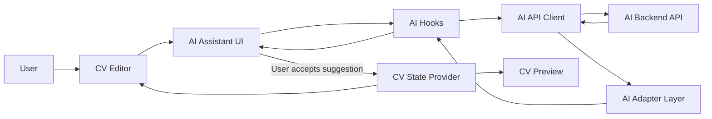

# EPIC: Frontend AI Assistant for CV Builder

## 1. Epic Summary

Build the frontend AI Assistant experience for the CV Builder.

The frontend will consume the completed AI backend and allow users to:
- generate professional experience bullet suggestions
- improve existing CV text
- analyze their CV and receive structured feedback
- review AI suggestions before applying them to the CV

This EPIC focuses only on the frontend.

The backend is already implemented and is treated as the source of truth for AI behavior and API contracts.

---

## 2. Product Goal

Help users create a stronger CV with less effort by giving contextual, reviewable AI assistance inside the existing CV editor experience.

The AI should feel like an assistant inside the workflow, not like a separate chatbot.

---

## 3. Core UX Principle

```txt
AI suggests → user reviews → user accepts/rejects → CV state updates
```

The AI must never silently overwrite user content.

Every AI-generated change must be explicitly accepted by the user.

---

## 4. Assumptions

The backend exposes these endpoints:

```txt
GET  /health

POST /api/ai/generate-experience-bullets
POST /api/ai/improve-text
POST /api/ai/analyze-cv
```

The backend response for suggestions follows this shape:

```ts
{
  suggestions: Array<{
    text: string;
    reason?: string;
  }>;
}
```

The frontend may duplicate small DTO types temporarily, but backend remains the source of truth.

The frontend should map backend DTOs to UI/domain models through adapters.

---

## 5. Main Technologies

Existing frontend stack:

- React
- TypeScript
- Vite
- React Hook Form
- Zod
- Existing CV state/provider architecture
- Existing editor/preview flow
- Existing CV model
- Existing styling system

New frontend additions:

- AI API client
- AI DTO types
- AI frontend/domain models
- AI adapters
- AI hooks
- AI suggestion UI components
- AI actions integrated into editor sections

---

## 6. Frontend Architecture Diagram



---

## 7. Proposed Frontend Folder Structure

```txt
src/
  features/
    ai-assistant/
      api/
        aiClient.ts
        aiEndpoints.ts

      adapters/
        aiSuggestionAdapter.ts
        aiAnalysisAdapter.ts

      components/
        AiActionButton.tsx
        AiSuggestionCard.tsx
        AiSuggestionList.tsx
        AiSuggestionPanel.tsx
        AiInlineAssistant.tsx
        AiAnalysisPanel.tsx

      hooks/
        useGenerateExperienceBullets.ts
        useImproveText.ts
        useAnalyzeCv.ts

      types/
        aiApi.types.ts
        ai.types.ts

      utils/
        aiErrors.ts

      index.ts
```

---

## 8. Frontend Architectural Rules

1. UI components must not consume backend DTOs directly.
2. API response DTOs must be mapped through adapters.
3. AI actions must not mutate CV state automatically.
4. User must explicitly accept a suggestion.
5. Loading, error, empty, and success states must be handled.
6. AI logic should be isolated under `features/ai-assistant`.
7. Existing CV domain/model should not be polluted with backend-specific AI types.
8. AI components should be reusable across different CV sections.
9. AI errors should be user-friendly.
10. Keep the first implementation simple but extensible.

---

# Phase 1 — Frontend AI Foundation

---

## Ticket 1 — Add AI Environment Configuration

### Description

As a developer, I want the frontend to know the backend API base URL so that AI requests can be sent to the correct service.

### Acceptance Criteria

- `VITE_API_BASE_URL` is supported.
- AI client uses the configured base URL.
- Missing base URL is handled clearly in development.
- `.env.example` is updated.
- No backend URL is hardcoded in components.

### Out of Scope

- AI UI
- API calls
- CV state updates

### Claude Prompt

```txt
You are a senior frontend engineer working on a React + TypeScript + Vite CV Builder.

Implement frontend environment configuration for the AI backend.

Context:
- The AI backend already exists as a separate service.
- The frontend is deployed to Vercel.
- The frontend must call the backend using VITE_API_BASE_URL.
- No backend URL should be hardcoded inside React components.

Requirements:
1. Add support for:
   VITE_API_BASE_URL

2. Create a small config module if the project does not already have one.
   Suggested file:
   src/config/env.ts

3. Export a typed config object with:
   - apiBaseUrl

4. In development, if VITE_API_BASE_URL is missing, make the error clear and easy to understand.

5. Update .env.example with:
   VITE_API_BASE_URL=http://localhost:4000

6. Do not introduce unnecessary dependencies.

7. Do not implement API calls yet.

Expected output:
- Typed frontend env config
- Updated .env.example
- No hardcoded API URL in UI code
```

---

## Ticket 2 — Add AI Frontend Types and DTOs

### Description

As a developer, I want frontend-local AI types so that the UI can interact with clean domain models while still understanding backend response DTOs.

### Acceptance Criteria

- Backend DTO types are defined locally.
- Frontend domain AI types are defined separately.
- DTO types are not used directly by UI components.
- Types cover:
  - AI suggestion
  - generate experience bullets request/response
  - improve text request/response
  - analyze CV request/response
  - AI loading states if useful

### Claude Prompt

```txt
You are a senior frontend engineer.

Add frontend AI types for a React + TypeScript CV Builder.

Context:
- The backend is the source of truth for the API.
- For V1, we will duplicate small DTO types in the frontend.
- UI components should not consume backend DTOs directly.
- We need a boundary between backend DTOs and frontend UI/domain models.

Create files:
- src/features/ai-assistant/types/aiApi.types.ts
- src/features/ai-assistant/types/ai.types.ts

Requirements:
1. In aiApi.types.ts, define backend DTO types:
   - GenerateExperienceBulletsRequestDto
   - GenerateExperienceBulletsResponseDto
   - ImproveTextRequestDto
   - ImproveTextResponseDto
   - AnalyzeCvRequestDto
   - AnalyzeCvResponseDto

2. In ai.types.ts, define frontend/domain types:
   - AiSuggestion
   - AiAnalysis
   - AiImprovement
   - AiRequestStatus or equivalent if useful

3. Backend suggestion DTO shape:
   {
     suggestions: Array<{
       text: string;
       reason?: string;
     }>
   }

4. Frontend suggestion model should use UI-friendly names:
   {
     id: string;
     content: string;
     explanation?: string;
   }

5. Keep types clean, readable, and strongly typed.

Constraints:
- Do not implement API calls.
- Do not add UI components.
- Do not import DTOs directly into future UI components except through adapters/hooks.
- Avoid any.
```

---

## Ticket 3 — Add AI Adapter Layer

### Description

As a developer, I want adapter functions that map backend DTOs to frontend models so that the UI remains decoupled from backend response shapes.

### Acceptance Criteria

- Suggestion DTOs map to `AiSuggestion`.
- Analysis DTO maps to `AiAnalysis`.
- Adapter handles missing optional fields safely.
- Adapter generates stable enough IDs for rendered suggestion lists.
- UI components can use adapter output directly.

### Claude Prompt

```txt
You are a senior frontend engineer.

Implement the AI adapter layer for a React + TypeScript CV Builder.

Context:
- The backend returns DTOs.
- The frontend should not spread backend DTOs across UI components.
- We need adapters at the API boundary.

Create files:
- src/features/ai-assistant/adapters/aiSuggestionAdapter.ts
- src/features/ai-assistant/adapters/aiAnalysisAdapter.ts

Requirements:
1. Implement a function to map:
   GenerateExperienceBulletsResponseDto | ImproveTextResponseDto
   into:
   AiSuggestion[]

2. Backend DTO:
   {
     suggestions: [
       { text: string, reason?: string }
     ]
   }

3. Frontend model:
   {
     id: string;
     content: string;
     explanation?: string
   }

4. Adapter should:
   - trim text
   - ignore invalid empty suggestions
   - map reason to explanation
   - create an id for each suggestion
   - avoid leaking DTO names outside adapter boundary

5. Implement analysis adapter:
   AnalyzeCvResponseDto -> AiAnalysis

6. Add focused unit tests for:
   - normal mapping
   - missing reason
   - empty suggestions
   - analysis mapping

Constraints:
- Do not call the backend.
- Do not create React components.
- Keep adapters pure and easy to test.
- Avoid any.
```

---

## Ticket 4 — Add AI API Client

### Description

As a developer, I want an AI API client that calls the backend endpoints and returns frontend-ready models through adapters.

### Acceptance Criteria

- AI client calls:
  - generate experience bullets
  - improve text
  - analyze CV
- Client uses `VITE_API_BASE_URL`.
- Client maps DTO responses using adapters.
- Client handles HTTP errors.
- Client does not expose raw DTOs to UI consumers.
- Client supports request cancellation if practical.

### Claude Prompt

```txt
You are a senior frontend engineer.

Implement the AI API client for the CV Builder frontend.

Context:
- The backend AI service is complete and deployed separately.
- The frontend should call it through VITE_API_BASE_URL.
- Backend DTOs must be adapted before reaching UI code.

Create:
- src/features/ai-assistant/api/aiEndpoints.ts
- src/features/ai-assistant/api/aiClient.ts

Backend endpoints:
- POST /api/ai/generate-experience-bullets
- POST /api/ai/improve-text
- POST /api/ai/analyze-cv

Requirements:
1. Use the frontend env config apiBaseUrl.

2. Implement:
   - generateExperienceBullets(input)
   - improveText(input)
   - analyzeCv(input)

3. Each function should:
   - send JSON request
   - handle non-2xx responses
   - parse JSON safely
   - map backend DTO to frontend model using adapters
   - return frontend/domain model, not DTO

4. Add a small AI client error utility:
   - user-friendly message
   - optional status code
   - optional backend error code

5. Keep API client independent from React.

6. Support AbortSignal as an optional parameter if it fits the existing project style.

7. Add unit tests or integration-style tests with mocked fetch.

Constraints:
- Do not create UI components.
- Do not mutate CV state.
- Do not leak backend DTOs outside the client/adapters.
- Do not add heavy data-fetching libraries unless already used by the project.
```

---

# Phase 2 — AI Hooks and State Management

---

## Ticket 5 — Add useImproveText Hook

### Description

As a developer, I want a hook for improving CV text so that editor components can trigger AI improvements without knowing API details.

### Acceptance Criteria

- Hook exposes:
  - `improveText`
  - `suggestions`
  - `status`
  - `error`
  - `reset`
- Hook uses AI client.
- Hook handles loading/error/success states.
- Hook avoids stale responses when multiple calls happen quickly.

### Claude Prompt

```txt
You are a senior React engineer.

Implement a useImproveText hook for the CV Builder AI assistant.

Context:
- The AI API client already exists.
- UI components should not call fetch directly.
- The hook should manage request state for improving text.
- The hook will be used inside editor sections.

Create:
- src/features/ai-assistant/hooks/useImproveText.ts

Requirements:
1. Expose:
   - improveText(input)
   - suggestions
   - status: "idle" | "loading" | "success" | "error"
   - error
   - reset()

2. Use the aiClient.improveText function.

3. Handle loading state correctly.

4. Handle errors with user-friendly messages.

5. Prevent stale response issues.
   If the user triggers a second request before the first finishes, the latest result should win.

6. If AbortController fits the existing style, use it to cancel previous in-flight requests.

7. Keep the hook reusable and independent from specific editor fields.

8. Add tests using mocked aiClient.

Constraints:
- Do not update CV state inside this hook.
- Do not render UI.
- Do not call backend DTOs directly.
- Avoid unnecessary global state.
```

---

## Ticket 6 — Add useGenerateExperienceBullets Hook

### Description

As a developer, I want a hook for generating experience bullets so that the experience editor can request AI bullet suggestions.

### Acceptance Criteria

- Hook exposes:
  - `generateBullets`
  - `suggestions`
  - `status`
  - `error`
  - `reset`
- Hook uses AI client.
- Hook handles duplicate/stale requests.
- Hook does not mutate CV state directly.

### Claude Prompt

```txt
You are a senior React engineer.

Implement a useGenerateExperienceBullets hook.

Context:
- The AI API client already exists.
- The hook will be used by the experience section of the CV editor.
- It should request bullet suggestions from the backend.
- It should not directly mutate CV state.

Create:
- src/features/ai-assistant/hooks/useGenerateExperienceBullets.ts

Requirements:
1. Expose:
   - generateBullets(input)
   - suggestions
   - status: "idle" | "loading" | "success" | "error"
   - error
   - reset()

2. Use aiClient.generateExperienceBullets.

3. Handle:
   - loading
   - success
   - error
   - empty suggestions

4. Avoid stale response issues when multiple calls are triggered quickly.

5. Support AbortController if aligned with existing project patterns.

6. Add tests using mocked aiClient.

Constraints:
- Do not update CV state inside the hook.
- Do not render UI.
- Do not depend on a specific editor component.
- Avoid global state unless absolutely necessary.
```

---

## Ticket 7 — Add useAnalyzeCv Hook

### Description

As a developer, I want a hook for CV analysis so that the UI can request structured feedback about the current CV.

### Acceptance Criteria

- Hook exposes:
  - `analyzeCv`
  - `analysis`
  - `status`
  - `error`
  - `reset`
- Hook accepts current CV model.
- Hook does not mutate CV state.
- Hook handles errors and empty analysis.

### Claude Prompt

```txt
You are a senior React engineer.

Implement a useAnalyzeCv hook for the CV Builder AI assistant.

Context:
- The backend supports POST /api/ai/analyze-cv.
- The frontend already has a CV model/state provider.
- This hook should only request analysis and expose the result.
- It should not mutate the CV.

Create:
- src/features/ai-assistant/hooks/useAnalyzeCv.ts

Requirements:
1. Expose:
   - analyzeCv(input)
   - analysis
   - status: "idle" | "loading" | "success" | "error"
   - error
   - reset()

2. Use aiClient.analyzeCv.

3. Accept:
   - cv
   - optional targetRole

4. Handle loading, error, success, and empty states.

5. Avoid stale response issues.

6. Add tests using mocked aiClient.

Constraints:
- Do not render UI.
- Do not update CV state.
- Do not import backend DTOs into components.
```

---

# Phase 3 — Reusable AI UI Components

---

## Ticket 8 — Build AI Suggestion Card and List Components

### Description

As a user, I want to see AI suggestions clearly so that I can decide whether to use them.

### Acceptance Criteria

- Suggestion card displays:
  - suggestion content
  - optional explanation
  - accept action
  - reject/dismiss action
- Suggestion list handles multiple suggestions.
- Components are reusable.
- Components are accessible.
- Components do not know about backend DTOs.

### Claude Prompt

```txt
You are a senior frontend engineer with strong UX and accessibility experience.

Build reusable AI suggestion UI components for a React + TypeScript CV Builder.

Context:
- AI hooks return frontend AiSuggestion models.
- Users must review AI suggestions before applying them.
- Components should be reusable across improve text and generate bullets flows.

Create:
- src/features/ai-assistant/components/AiSuggestionCard.tsx
- src/features/ai-assistant/components/AiSuggestionList.tsx

Requirements:
1. AiSuggestionCard should display:
   - suggestion content
   - optional explanation
   - Accept button
   - Dismiss/Reject button

2. AiSuggestionList should render multiple AiSuggestionCard components.

3. Props should be strongly typed:
   - suggestions
   - onAccept
   - onDismiss
   - optional isLoading
   - optional empty message

4. Accessibility:
   - Buttons must have clear accessible labels.
   - Do not use clickable divs.
   - Ensure keyboard usage works naturally.

5. Styling:
   - Match existing project styling conventions.
   - Keep UI minimal and clean.
   - Avoid adding a new UI library.

6. Add component tests if the project already supports component testing.

Constraints:
- Do not call the API from these components.
- Do not mutate CV state directly.
- Do not use backend DTO types.
```

---

## Ticket 9 — Build AI Suggestion Panel

### Description

As a user, I want AI suggestions to appear in a predictable panel so that the editor remains clean and easy to use.

### Acceptance Criteria

- Panel handles:
  - idle
  - loading
  - success
  - empty
  - error
- Panel renders suggestion list.
- Panel exposes accept/reject callbacks.
- Panel can be reused across AI actions.

### Claude Prompt

```txt
You are a senior frontend engineer.

Build a reusable AiSuggestionPanel component.

Context:
- AI hooks expose status, suggestions, and error.
- We need a reusable UI container for AI suggestions.
- The panel will be used by improve text and generate bullets flows.

Create:
- src/features/ai-assistant/components/AiSuggestionPanel.tsx

Requirements:
1. Support states:
   - idle
   - loading
   - success
   - empty
   - error

2. Render:
   - title
   - optional description
   - loading indicator
   - error message
   - empty message
   - AiSuggestionList when suggestions exist

3. Accept props:
   - status
   - suggestions
   - error
   - onAcceptSuggestion
   - onDismissSuggestion
   - onRetry optional
   - onClose optional

4. Keep it reusable and presentation-focused.

5. Do not include API calls.

6. Do not update CV state internally.

7. Follow existing styling conventions.

8. Ensure accessibility:
   - proper buttons
   - readable error state
   - no keyboard traps

Constraints:
- No backend DTO imports.
- No global state.
- No unnecessary dependencies.
```

---

## Ticket 10 — Build AI Action Button

### Description

As a user, I want clear AI action buttons inside the editor so that I can request help when needed.

### Acceptance Criteria

- Reusable button exists.
- Supports loading state.
- Supports disabled state.
- Has accessible label.
- Does not know about backend details.

### Claude Prompt

```txt
You are a senior frontend engineer.

Build a reusable AI action button component.

Context:
- AI actions will be used in different editor sections.
- The button should trigger AI actions like "Improve text" or "Generate bullets".
- It must be reusable and accessible.

Create:
- src/features/ai-assistant/components/AiActionButton.tsx

Requirements:
1. Props:
   - label
   - onClick
   - isLoading
   - disabled
   - ariaLabel optional

2. Render a native button.

3. Show a loading state when isLoading is true.

4. Prevent duplicate clicks while loading.

5. Match existing project styling conventions.

6. Add tests if component tests exist.

Constraints:
- Do not call AI API inside the button.
- Do not import CV state.
- Do not use clickable divs.
```

---

# Phase 4 — Editor Integration

---

## Ticket 11 — Integrate Improve Text into Summary Section

### Description

As a user, I want to improve my CV summary using AI so that I can make it clearer, more professional, and more impactful.

### Acceptance Criteria

- Summary field has an AI improve action.
- Clicking action sends current summary text to backend.
- Suggestions are displayed.
- User can accept a suggestion.
- Accepted suggestion updates only the summary field.
- User can dismiss suggestions.
- Empty summary is handled gracefully.

### Claude Prompt

```txt
You are a senior frontend engineer working on an existing CV Builder editor.

Integrate the AI improve text flow into the Summary section.

Context:
- The AI API client, hooks, and suggestion components already exist.
- The existing editor has CV state management and form handling.
- The AI must not automatically overwrite user content.
- User must explicitly accept a suggestion.

Requirements:
1. Find the Summary section/editor component.

2. Add an AI action:
   "Improve summary"

3. When clicked:
   - read the current summary text
   - call useImproveText with:
     section: "summary"
     text: current summary
     tone: "professional" or existing default

4. Show AiSuggestionPanel near the summary field.

5. When user accepts a suggestion:
   - update only the summary field
   - preserve all other CV data
   - close or reset suggestions after applying

6. Handle edge cases:
   - empty summary
   - loading state
   - backend error
   - no suggestions

7. Follow existing project patterns for state updates and forms.

8. Do not introduce a new global state library.

Constraints:
- Do not mutate state directly.
- Do not call fetch directly from the component.
- Do not automatically apply AI output.
- Do not couple the component to backend DTOs.
```

---

## Ticket 12 — Integrate Improve Text into Experience Bullet Editing

### Description

As a user, I want to improve an existing experience bullet using AI so that each bullet sounds more professional and impact-oriented.

### Acceptance Criteria

- Each editable experience bullet can trigger AI improvement.
- Current bullet text is sent to backend.
- Suggestions are shown for that specific bullet.
- Accepting a suggestion updates only that bullet.
- Multiple bullets do not conflict with each other.
- Stale suggestions are avoided when switching bullets.

### Claude Prompt

```txt
You are a senior frontend engineer.

Integrate AI improve text into experience bullet editing.

Context:
- The editor already supports experience entries and bullet points.
- The AI improve hook and suggestion panel already exist.
- Users should be able to improve one bullet at a time.
- AI suggestions must not be applied automatically.

Requirements:
1. Locate the experience editor section and bullet editing UI.

2. Add an AI action for each bullet:
   "Improve bullet"

3. When clicked:
   - capture the selected bullet text
   - call useImproveText with:
     section: "experience"
     text: bullet text
     tone: "impactful"

4. Show suggestions near the active bullet or in a clear local panel.

5. Track which bullet is currently being improved.
   Use stable identifiers if the CV model has them.
   If not, use experience index + bullet index carefully.

6. When user accepts a suggestion:
   - update only the active bullet
   - preserve all other experience data
   - reset AI suggestion state

7. Handle:
   - empty bullet
   - loading state per active bullet
   - error state
   - switching between bullets

8. Follow existing CV state update patterns.

Constraints:
- Do not call the backend directly from the component.
- Do not overwrite all bullets.
- Do not apply suggestions automatically.
- Do not leak backend DTOs into UI.
- Avoid large refactors unless necessary.
```

---

## Ticket 13 — Integrate Generate Bullets into Experience Section

### Description

As a user, I want to generate experience bullet suggestions from my role details so that I can quickly add strong content to my CV.

### Acceptance Criteria

- Experience section has a generate bullets action.
- Action uses available role/company/technologies/responsibilities context.
- Suggestions are displayed.
- Accepting a suggestion adds it as a new bullet or replaces an empty bullet depending on current UX.
- Existing bullets are preserved.
- User can reject suggestions.

### Claude Prompt

```txt
You are a senior frontend engineer.

Integrate AI-generated experience bullets into the Experience section.

Context:
- The backend supports generateExperienceBullets.
- The frontend has useGenerateExperienceBullets hook and suggestion panel.
- The existing CV editor has an experience section.
- Users should review generated bullets before adding them.

Requirements:
1. Locate the experience editor section.

2. Add an AI action:
   "Generate bullets"

3. Build the request input from available experience fields:
   - role/title
   - company
   - technologies if available
   - current responsibilities or existing bullets if useful
   - targetRole if available in the app
   - tone: "impactful"

4. Call useGenerateExperienceBullets.

5. Display suggestions using AiSuggestionPanel.

6. When user accepts a suggestion:
   - add it as a bullet to the active experience entry
   - preserve existing bullets
   - avoid duplicates when possible

7. If there is an empty bullet field, prefer filling it instead of adding a new one if that matches current UX.

8. Handle:
   - missing role/title
   - loading state
   - error state
   - empty suggestions

9. Follow existing CV state update patterns.

Constraints:
- Do not auto-apply all suggestions.
- Do not overwrite existing bullets.
- Do not call fetch directly.
- Do not import backend DTOs.
```

---

# Phase 5 — CV Analysis UX

---

## Ticket 14 — Build CV Analysis Panel

### Description

As a user, I want to see AI feedback about my CV so that I can understand what is strong and what needs improvement.

### Acceptance Criteria

- Panel displays:
  - score
  - strengths
  - improvements
- Improvements show priority.
- Panel handles loading, error, and empty states.
- Panel does not mutate CV state.

### Claude Prompt

```txt
You are a senior frontend engineer with product UX experience.

Build a CV Analysis Panel for the AI assistant.

Context:
- The backend supports analyzeCv.
- The frontend has useAnalyzeCv hook.
- The panel should show structured feedback but should not modify the CV automatically.

Create:
- src/features/ai-assistant/components/AiAnalysisPanel.tsx

Requirements:
1. Display:
   - score
   - strengths
   - improvements

2. Each improvement should show:
   - section
   - message
   - priority

3. Support states:
   - idle
   - loading
   - success
   - empty
   - error

4. Provide a clear UX for:
   - "Analyze CV"
   - retry on error

5. Keep the component presentation-focused.

6. Ensure accessibility:
   - semantic headings
   - readable lists
   - buttons are native buttons

7. Match existing project styling.

Constraints:
- Do not update CV state.
- Do not call fetch directly.
- Do not use backend DTO types.
- Do not create a chatbot UI.
```

---

## Ticket 15 — Integrate CV Analysis into Editor or Preview

### Description

As a user, I want to analyze my current CV from the editor/preview so that I can get feedback before exporting it.

### Acceptance Criteria

- User can trigger CV analysis.
- Current CV model is sent to backend.
- Analysis panel displays feedback.
- Analysis does not block editing.
- Errors are handled gracefully.
- No automatic CV changes are applied.

### Claude Prompt

```txt
You are a senior frontend engineer.

Integrate CV analysis into the CV Builder flow.

Context:
- The AI backend supports analyzeCv.
- The frontend has useAnalyzeCv and AiAnalysisPanel.
- The existing app has an editor and preview experience.
- The analysis should guide the user, not automatically change content.

Requirements:
1. Decide the best integration point based on the current UI:
   - editor sidebar
   - preview area
   - top-level assistant panel
   Choose the least invasive option.

2. Add an "Analyze CV" action.

3. When clicked:
   - get the current CV model from existing state/provider
   - call useAnalyzeCv

4. Render AiAnalysisPanel.

5. Handle:
   - loading
   - success
   - empty
   - error

6. Ensure analysis does not mutate CV state.

7. Ensure the user can continue editing after analysis.

8. Follow existing project layout and styling conventions.

Constraints:
- Do not add routing unless necessary.
- Do not introduce new global state.
- Do not automatically apply suggestions.
- Do not call backend DTOs directly.
```

---

# Phase 6 — UX Polish and Hardening

---

## Ticket 16 — Add AI Error UX and Empty States

### Description

As a user, I want clear feedback when AI cannot generate suggestions so that I understand what happened and what I can do next.

### Acceptance Criteria

- User-friendly AI error messages exist.
- Empty suggestion states are clear.
- Retry actions are available where useful.
- Raw backend/provider errors are not shown.
- Error handling is consistent across AI features.

### Claude Prompt

```txt
You are a senior frontend engineer.

Improve AI error UX and empty states across the AI assistant frontend.

Context:
- AI actions can fail due to validation, network, backend errors, provider errors, or empty responses.
- Users should see simple, helpful messages.
- We should not show raw backend or provider errors directly.

Requirements:
1. Create or update:
   src/features/ai-assistant/utils/aiErrors.ts

2. Define user-friendly messages for:
   - network error
   - validation error
   - generation failed
   - empty suggestions
   - unknown error

3. Update AI hooks/components to use consistent error messages.

4. Add retry support where appropriate.

5. Ensure empty state messaging is helpful:
   Example:
   "No suggestions were generated. Try adding more context."

6. Add tests for error mapping if practical.

Constraints:
- Do not expose raw provider errors.
- Do not add a toast system unless the project already has one.
- Do not overcomplicate error handling.
```

---

## Ticket 17 — Add AI Feature Flags / Safe Toggle

### Description

As a developer, I want an easy way to enable or disable AI UI so that the feature can be safely rolled out.

### Acceptance Criteria

- AI UI can be toggled with an env flag.
- Default behavior is clear.
- If disabled, no AI buttons/panels are rendered.
- Existing CV editor still works normally.

### Claude Prompt

```txt
You are a senior frontend engineer.

Add a safe frontend feature toggle for AI functionality.

Context:
- The AI backend exists.
- The frontend AI feature may need to be hidden during development or deployment.
- We want a simple Vite env-based flag.

Requirements:
1. Add support for:
   VITE_ENABLE_AI=true/false

2. Add it to the frontend env config.

3. Add it to .env.example.

4. Use it to conditionally render AI UI entry points:
   - Improve summary
   - Improve bullet
   - Generate bullets
   - Analyze CV

5. If disabled:
   - no AI actions should be visible
   - existing editor behavior should be unchanged

6. Avoid scattering raw env checks everywhere.
   Prefer a small config/helper.

Constraints:
- Do not remove AI code.
- Do not call backend when disabled.
- Do not add a remote feature flag service yet.
```

---

## Ticket 18 — Add Basic Frontend Tests for AI Flows

### Description

As a developer, I want tests for critical AI frontend behavior so that we can prevent regressions.

### Acceptance Criteria

- AI client tests exist.
- Adapter tests exist.
- Hook tests exist.
- Suggestion component tests exist if test setup supports it.
- Editor integration has at least focused tests for accepting suggestions if practical.

### Claude Prompt

```txt
You are a senior frontend engineer.

Add basic tests for the AI assistant frontend.

Context:
- The AI assistant includes API client, adapters, hooks, components, and editor integration.
- We need confidence without over-testing implementation details.

Requirements:
1. Add or update tests for adapters:
   - maps suggestions correctly
   - handles missing reason
   - ignores empty suggestions

2. Add tests for aiClient:
   - successful response
   - non-2xx response
   - malformed response if practical

3. Add tests for hooks:
   - loading state
   - success state
   - error state
   - stale response behavior if implemented

4. Add component tests for:
   - AiSuggestionCard
   - AiSuggestionList
   - AiSuggestionPanel

5. Add focused integration tests if practical:
   - accepting a suggestion updates the intended field
   - existing content is not overwritten unexpectedly

Constraints:
- Do not make tests brittle.
- Do not test implementation details unnecessarily.
- Mock network calls.
- Do not call real backend.
```

---

# Recommended Implementation Order

```txt
1. Add AI Environment Configuration
2. Add AI Frontend Types and DTOs
3. Add AI Adapter Layer
4. Add AI API Client
5. Add useImproveText Hook
6. Add useGenerateExperienceBullets Hook
7. Add useAnalyzeCv Hook
8. Build AI Suggestion Card and List Components
9. Build AI Suggestion Panel
10. Build AI Action Button
11. Integrate Improve Text into Summary Section
12. Integrate Improve Text into Experience Bullet Editing
13. Integrate Generate Bullets into Experience Section
14. Build CV Analysis Panel
15. Integrate CV Analysis into Editor or Preview
16. Add AI Error UX and Empty States
17. Add AI Feature Flags / Safe Toggle
18. Add Basic Frontend Tests for AI Flows
```

---

# Definition of Done

The frontend AI EPIC is complete when:

- Frontend can call the AI backend through configured API base URL.
- AI client maps backend DTOs to frontend models.
- AI hooks handle loading/success/error states.
- Summary text can be improved with AI.
- Existing experience bullets can be improved with AI.
- New experience bullets can be generated with AI.
- CV analysis can be triggered from the UI.
- User must accept suggestions before CV state changes.
- AI UI can be disabled through a feature flag.
- Core adapters, hooks, and components have tests.
- No backend DTOs are leaked into UI components.
- No API keys exist in the frontend.

---

# Final Product Rule

```txt
The backend owns AI behavior.
The frontend owns AI experience.
The user owns the final CV content.
```
