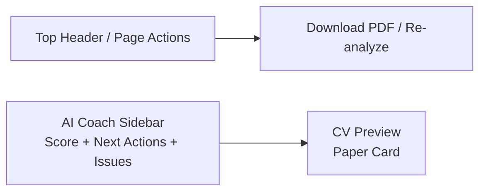

# EPIC: Review Mode UX Redesign — AI Coach Sidebar + CV Preview

## 1. Epic Summary

Redesign the current Preview / Analyze CV page into a dedicated **Review Mode** experience.

The goal is to transform the page from:

```txt
Preview page + analysis block
```

Into:

```txt
AI Coach Sidebar + Live CV Preview workspace
```

This page should help users understand their CV quality, prioritize improvements, and navigate back to the right editor sections without overwhelming them.

---

## 2. Product Goal

Create a premium review experience where the user feels guided by an AI coach.

The page should answer:

1. How strong is my CV?
2. What should I improve first?
3. Where do I go to fix it?
4. Can I still clearly preview/download my CV?

---

## 3. Core UX Principle

```txt
Analyze → Prioritize → Navigate → Improve
```

This page should not feel like a list of errors.

It should feel like a calm, guided improvement workspace.

---

## 4. Reference Design Direction

The target layout is inspired by the Stitch-generated design:

```txt
----------------------------------------------------
| Header / Actions                                  |
----------------------------------------------------
| AI Coach Sidebar      |   CV Preview              |
| Score                 |   Paper-like document     |
| Next Best Actions     |   Centered, readable      |
| Issues by Severity    |                           |
| Re-analyze            |                           |
----------------------------------------------------
```

---

## 5. Existing Context

The app already has:

- React 19
- TypeScript
- Vite
- Tailwind
- CV editor wizard
- Preview page
- PDF download
- AI analyze endpoint
- AI analyze button
- CV state provider
- i18n support
- Template system
- Existing AI backend integration

This EPIC focuses on improving the **Review / Preview / Analyze page UX**.

---

## 6. Design Principles

1. CV preview remains the hero.
2. AI analysis lives in a sidebar, not above the preview.
3. Score should motivate, not scare.
4. Issues should be grouped and prioritized.
5. Avoid full red panels unless issue is truly critical.
6. Each issue should be actionable.
7. Navigation should connect review insights back to editor steps.
8. The page should feel like a coach, not a validator.
9. Keep the first implementation clean; advanced “Fix with AI” can be added progressively.
10. No automatic CV mutations from this page.

---

## 7. Proposed Layout



Detailed layout:

```txt
Review Mode Page
  Header
    Editor link
    Preview active
    Download PDF

  Main Layout
    Left Sidebar
      Score Card
      Next Best Actions
      Issues grouped by severity
      Re-analyze CV

    Right Content
      CV Preview Paper
```

---

# Phase 1 — Page Layout Foundation

---

## Ticket 1 — Refactor Preview Page into Review Mode Layout

### Description

As a user, I want the preview page to feel like a dedicated review workspace so that I can preview my CV and see AI guidance side-by-side.

### Acceptance Criteria

- Current preview page layout is refactored into a two-column Review Mode layout.
- Left column is reserved for AI Coach sidebar.
- Right column contains the existing CV preview.
- PDF download remains available.
- Existing preview rendering is preserved.
- Layout is responsive.
- On smaller screens, sidebar stacks above preview.

### Suggested Layout

Desktop:

```txt
[Sidebar 360px] [CV Preview flexible]
```

Mobile/tablet:

```txt
[AI Coach Panel]
[CV Preview]
```

### Claude Prompt

```txt
You are a senior frontend engineer and product-minded UI engineer.

Refactor the current Preview page into a Review Mode layout.

Context:
- This is a React + TypeScript + Vite CV Builder.
- The existing preview page already renders the CV preview and has Download PDF functionality.
- The page also currently supports AI analysis, but the layout needs to become a dedicated Review Mode workspace.
- The target design is a two-column layout:
  - Left: AI Coach Sidebar
  - Right: CV Preview

Requirements:
1. Find the current Preview page/component.

2. Refactor the layout into:
   - A left sidebar container with fixed width around 340–380px on desktop.
   - A right preview area that keeps the CV preview centered and readable.
   - A top action area that still includes Download PDF and navigation back to Editor if already present.

3. Preserve all existing CV preview behavior.
   Do not break templates, theme, language, or PDF download.

4. Make the layout responsive:
   - Desktop: sidebar + preview side by side.
   - Smaller screens: sidebar above preview.

5. Use existing styling conventions and Tailwind classes.

6. Do not implement new AI logic yet.
   Use placeholder/sidebar component if necessary.

7. Avoid large unrelated refactors.

Expected output:
- Preview page visually becomes Review Mode.
- Existing preview still works.
- Download PDF still works.
- Layout is ready to host AI Coach Sidebar.
```

---

## Ticket 2 — Create AI Coach Sidebar Shell

### Description

As a user, I want a dedicated AI coach area so that analysis feedback feels organized and separate from the CV preview.

### Acceptance Criteria

- New `AiCoachSidebar` component exists.
- Sidebar has sections:
  - Score summary
  - Next best actions
  - Issues
  - Re-analyze action
- Component accepts props and does not fetch data internally yet.
- Empty state exists when no analysis has been run.

### Claude Prompt

```txt
You are a senior frontend engineer.

Create the AI Coach Sidebar shell for the Review Mode page.

Context:
- The Review Mode layout exists or is being created.
- The sidebar will display AI analysis results.
- It should be presentation-focused and reusable.
- It should not call the backend directly.

Create component:
src/features/ai-assistant/components/AiCoachSidebar.tsx

Requirements:
1. The sidebar should render these sections:
   - Score summary
   - Next best actions
   - Issues grouped by severity
   - Re-analyze action

2. Accept props for:
   - analysis
   - status
   - error
   - onAnalyze
   - onGoToSection

3. Support states:
   - idle: no analysis yet
   - loading
   - success
   - error
   - empty

4. Keep the UI calm and readable.
   Avoid large red blocks.

5. Use existing design tokens/Tailwind conventions.

6. Do not call the API from this component.

7. Do not mutate CV state.

Expected output:
- AiCoachSidebar shell component
- Clean prop API
- Basic states supported
```

---

# Phase 2 — Score UX

---

## Ticket 3 — Build Score Summary Card

### Description

As a user, I want to understand what my CV score means so that I feel guided instead of judged.

### Acceptance Criteria

- Score is displayed prominently.
- Score includes `/100`.
- Score has a contextual message.
- Message changes based on score range.
- Visual treatment is motivating, not alarming.

### Score Messaging Proposal

```txt
90–100: Excellent CV
80–89: Strong CV
60–79: Good start
0–59: Needs attention
```

### Claude Prompt

```txt
You are a senior frontend engineer with strong product UX skills.

Build a Score Summary card for the AI Coach Sidebar.

Context:
- The AI analysis returns a numeric score from 0 to 100.
- The current UI shows a score, but we want the score to feel meaningful and motivating.
- This should be part of the Review Mode AI Coach Sidebar.

Create component if useful:
src/features/ai-assistant/components/AiScoreCard.tsx

Requirements:
1. Display score prominently:
   Example: 85 / 100

2. Add contextual label based on score:
   - 90–100: "Excelente CV"
   - 80–89: "CV sólido"
   - 60–79: "Buen inicio"
   - below 60: "Necesita atención"

3. Add a short motivational message:
   Example:
   "Tu CV está fuerte. Algunos ajustes pueden hacerlo destacar más."

4. Keep visual design clean and premium.
   A circular score indicator is optional.
   If implementing it adds too much complexity, use a simpler score card.

5. Avoid scary/error-like styling.

6. Add unit tests for score label helper if practical.

Constraints:
- Do not call the backend.
- Do not mutate CV state.
- Do not overbuild charts unless simple.
```

---

## Ticket 4 — Add Score Helper Utilities

### Description

As a developer, I want score interpretation logic isolated so that score labels and messages are consistent.

### Acceptance Criteria

- Helper maps score to:
  - label
  - message
  - severity style
- Helper is tested.
- Component does not contain complex score conditionals inline.

### Claude Prompt

```txt
You are a senior frontend engineer.

Create helper utilities for interpreting AI CV scores.

Context:
- The Review Mode sidebar shows an AI CV score.
- We need consistent labels and messages based on score ranges.

Create:
src/features/ai-assistant/utils/scoreHelpers.ts

Requirements:
1. Implement helper:
   getScoreFeedback(score: number)

2. Return:
   - label
   - message
   - tone: "excellent" | "strong" | "good" | "needs-work"

3. Suggested ranges:
   - 90–100: excellent
   - 80–89: strong
   - 60–79: good
   - 0–59: needs-work

4. Clamp or safely handle invalid scores.

5. Add unit tests.

Constraints:
- No React code in helper.
- Keep it simple and deterministic.
```

---

# Phase 3 — Next Best Actions

---

## Ticket 5 — Build Next Best Actions Section

### Description

As a user, I want to know what to fix first so that I do not feel overwhelmed by all feedback.

### Acceptance Criteria

- Sidebar shows top 2–3 recommended actions.
- Actions are derived from analysis improvements.
- High priority issues appear first.
- Each action has:
  - title
  - short description
  - action button
- Button navigates to the relevant editor section.

### Claude Prompt

```txt
You are a senior frontend engineer and product-minded UX engineer.

Build the "Next Best Actions" section for the AI Coach Sidebar.

Context:
- The AI analysis returns improvements with section, message, and priority.
- Users need guidance on what to fix first.
- We want to show only the top 2–3 most important actions.

Create component if useful:
src/features/ai-assistant/components/AiNextBestActions.tsx

Requirements:
1. Accept a list of analysis improvements.

2. Derive top actions:
   - Sort by priority: high > medium > low.
   - Limit to 2 or 3 actions.
   - Avoid duplicate actions if the same section/message repeats.

3. Render each action as a compact card:
   - title
   - short description
   - "Ir a sección" button

4. Use a calm visual style.
   Do not make every action look like an error.

5. The button should call:
   onGoToSection(section)

6. If there are no actions, show a positive empty state:
   "No hay acciones prioritarias por ahora."

7. Do not call router directly if existing app patterns prefer callbacks.
   If unsure, inspect current navigation patterns and follow them.

Constraints:
- Do not call the backend.
- Do not mutate CV state.
- Do not show more than 3 actions.
```

---

## Ticket 6 — Add Improvement Deduplication Logic

### Description

As a user, I do not want to see repeated issues that make the AI feel noisy or unintelligent.

### Acceptance Criteria

- Duplicate improvements are removed or grouped.
- Same section repeated multiple times is grouped.
- Same/similar messages do not appear as separate cards.
- Logic is isolated and testable.

### Claude Prompt

```txt
You are a senior frontend engineer.

Add deduplication/grouping logic for AI analysis improvements.

Context:
- The backend may return multiple improvements for the same section or similar issue.
- The UI should feel smart and reduce repetition.
- We need clean derived data for the AI Coach Sidebar.

Create or update:
src/features/ai-assistant/utils/analysisHelpers.ts

Requirements:
1. Implement helpers to:
   - group improvements by section
   - group improvements by priority
   - remove obvious duplicates
   - sort by priority

2. Priority order:
   high > medium > low

3. Dedupe strategy:
   - If same section and same message, keep one.
   - If same section has multiple messages, group under one section when rendering.
   - If unsure about semantic duplicates, keep the content but avoid repeating identical cards.

4. Add unit tests for:
   - duplicate messages
   - multiple issues in same section
   - priority sorting
   - empty input

Constraints:
- Do not change backend contracts.
- Do not mutate the original input array.
- Keep helpers pure and deterministic.
```

---

# Phase 4 — Issues UX

---

## Ticket 7 — Build Issues Grouped by Severity

### Description

As a user, I want issues grouped by importance so that I can focus on the most important improvements first.

### Acceptance Criteria

- Issues are grouped into:
  - High impact
  - Medium impact
  - Low impact
- High impact is shown first.
- Each group has count.
- Groups can be collapsed/expanded if there are many items.
- High impact is expanded by default.
- Red is used only for high impact.

### Claude Prompt

```txt
You are a senior frontend engineer with strong UX judgment.

Build the issues section for the AI Coach Sidebar.

Context:
- The AI analysis returns improvements with priority.
- The current UI is too red and overwhelming.
- We need grouped, calm, prioritized feedback.

Create component if useful:
src/features/ai-assistant/components/AiIssuesBySeverity.tsx

Requirements:
1. Group improvements by priority:
   - high
   - medium
   - low

2. Display group labels:
   - Alto impacto
   - Impacto medio
   - Bajo impacto

3. Include issue count per group.

4. Show high impact first.

5. Use visual treatment:
   - high: red accent only, not full red panels
   - medium: yellow/orange accent
   - low: neutral/gray accent

6. If many items exist, support collapsible groups.
   Default:
   - high open
   - medium optional open
   - low collapsed

7. Each issue should render using a dedicated issue card component.

8. Avoid dense paragraphs.

Constraints:
- Do not call backend.
- Do not mutate CV state.
- Do not use huge red blocks for every issue.
```

---

## Ticket 8 — Build Issue Card Component

### Description

As a user, I want each issue to be clear, scannable, and actionable.

### Acceptance Criteria

- Each issue card shows:
  - section/title
  - short message
  - priority indicator
  - action button: `Ir a sección`
- Text is short and readable.
- Long messages are not shown as walls of text.
- Component is accessible.

### Claude Prompt

```txt
You are a senior frontend engineer.

Build an AI analysis issue card component.

Context:
- The Review Mode sidebar displays AI analysis improvements.
- Each improvement should be easy to scan and act on.
- We want to avoid long red text blocks.

Create component:
src/features/ai-assistant/components/AiIssueCard.tsx

Requirements:
1. Props:
   - section
   - message
   - priority
   - onGoToSection

2. Render:
   - section/title
   - short message
   - priority badge or accent
   - "Ir a sección" button

3. If message is long:
   - keep card readable
   - optionally clamp or structure text
   - avoid large paragraphs

4. Use semantic buttons.

5. Add hover state.

6. Match existing Tailwind styling.

7. Do not auto-fix or mutate the CV.

Constraints:
- Do not call backend.
- Do not import backend DTOs directly if the app uses adapted models.
- Do not use clickable divs.
```

---

## Ticket 9 — Improve Analysis Text Formatting

### Description

As a user, I want AI feedback to be easy to understand quickly.

### Acceptance Criteria

- Long issue messages are converted into scannable content where possible.
- UI avoids dense paragraphs.
- Repeated raw backend text is not displayed awkwardly.
- If structured fields are not available, fallback gracefully.

### Claude Prompt

```txt
You are a senior frontend engineer and UX writer.

Improve how AI analysis issue messages are displayed.

Context:
- Some backend messages may be long and paragraph-like.
- The current UI can feel overwhelming.
- We need a UI-side formatting strategy without changing the backend contract.

Requirements:
1. Inspect the current analysis data shape.

2. If improvements only include a single message string:
   - display a concise primary message.
   - optionally show details in a smaller secondary text.
   - avoid full paragraph blocks when possible.

3. Add helper if useful:
   formatImprovementMessage(message: string)

4. The helper can:
   - trim text
   - split obvious example text if needed
   - shorten overly long content for the card
   - preserve full text in a title/expanded area if useful

5. Keep the UI readable and truthful.
   Do not invent new content.

6. Add tests for formatting helper if implemented.

Constraints:
- Do not change backend API.
- Do not remove important warning information entirely.
- Do not add complex NLP logic.
- Keep formatting predictable.
```

---

# Phase 5 — Navigation Back to Editor

---

## Ticket 10 — Implement Section Navigation from Review Mode

### Description

As a user, I want to jump directly from an analysis issue to the relevant editor section so that I can fix the issue quickly.

### Acceptance Criteria

- `Ir a sección` navigates to the right editor step.
- Mapping supports:
  - profile/summary
  - experience
  - education
  - skills
- Unknown section falls back gracefully.
- Navigation preserves current CV state.
- Existing routing patterns are respected.

### Suggested Mapping

```txt
profile / summary → step 1
experience → step 2
education → step 3
skills → step 4
review → step 5
```

### Claude Prompt

```txt
You are a senior frontend engineer.

Implement navigation from Review Mode analysis items back to the correct editor section.

Context:
- The CV Builder has a multi-step editor wizard.
- The Review Mode sidebar shows issues by section.
- Each issue has an "Ir a sección" action.
- The user should be taken to the relevant editor step.

Requirements:
1. Inspect the current routing/editor step implementation.

2. Create a mapping from analysis section to editor step:
   - profile/summary/contact → step 1
   - experience → step 2
   - education → step 3
   - skills → step 4
   - unknown → sensible fallback

3. Implement onGoToSection(section).

4. Ensure CV state is preserved.

5. Use the existing navigation/routing style.
   Do not introduce a new router pattern if the app already has one.

6. Add tests for section-to-step mapping helper if practical.

Constraints:
- Do not mutate CV content.
- Do not auto-fix issues.
- Do not add unnecessary global state.
```

---

## Ticket 11 — Highlight Target Section After Navigation

### Description

As a user, I want to understand where I landed after clicking an issue action.

### Acceptance Criteria

- After navigating to a section, the relevant section or field is briefly highlighted if practical.
- If exact field targeting is hard, section-level highlighting is acceptable.
- Highlight is temporary and subtle.
- No layout jank.

### Claude Prompt

```txt
You are a senior frontend engineer.

Add subtle target highlighting after navigating from Review Mode to the editor.

Context:
- Users can click "Ir a sección" from an analysis issue.
- They should understand where to focus after navigation.
- Exact field-level targeting may not always be possible.

Requirements:
1. Inspect current editor step structure.

2. Implement a lightweight way to indicate the target section after navigation.
   Options:
   - query param
   - navigation state
   - temporary UI state
   Follow the existing project style.

3. Highlight the target section briefly.
   Example:
   - subtle border
   - soft background
   - fade out after 1–2 seconds

4. If exact issue-to-field mapping is not reliable, highlight the whole section.

5. Keep it accessible and non-disruptive.

Constraints:
- Do not create complex targeting architecture yet.
- Do not break editor navigation.
- Do not permanently alter styling.
```

---

# Phase 6 — Re-analyze and Loading States

---

## Ticket 12 — Improve Re-analyze UX

### Description

As a user, I want to re-run the analysis after making changes so that I can see whether my CV improved.

### Acceptance Criteria

- Re-analyze action is visible in sidebar.
- Loading state is clear.
- Previous results are handled gracefully while re-analyzing.
- User cannot trigger duplicate requests.
- Errors are shown in sidebar.

### Claude Prompt

```txt
You are a senior frontend engineer.

Improve the Re-analyze CV experience in Review Mode.

Context:
- The backend supports analyze CV.
- The frontend already has or will use useAnalyzeCv.
- The sidebar should allow users to re-run analysis after making changes.

Requirements:
1. Add a visible "Re-analizar CV" action in the AI Coach Sidebar.

2. When clicked:
   - call the existing analyze CV hook/client flow.
   - show a clear loading state.

3. Prevent duplicate requests while loading.

4. Decide how to handle existing results during loading:
   - either keep previous results visible with subtle loading indicator
   - or show a loading overlay
   Choose the better UX based on current implementation.

5. Handle errors gracefully:
   - user-friendly message
   - retry possible

6. Do not reset CV state.

Constraints:
- Do not call backend directly from presentation-only components.
- Do not auto-fix any issue.
- Do not expose raw backend errors.
```

---

## Need to execute this ticket
## Ticket 13 — Add Empty and First-Time Analysis States

### Description

As a user, I want a helpful first-time state before analysis has been run.

### Acceptance Criteria

- If no analysis exists, sidebar shows a useful empty state.
- Empty state explains what analysis does.
- Includes CTA: `Analizar CV`
- Does not show fake score.

### Claude Prompt

```txt
You are a senior frontend engineer with strong UX instincts.

Add first-time and empty states to the AI Coach Sidebar.

Context:
- Users may open Review Mode before running AI analysis.
- The UI should explain the value without looking broken.
- We should not show fake analysis data.

Requirements:
1. If analysis status is idle/no data:
   - show a friendly empty state
   - explain that AI can review the CV and suggest improvements
   - show CTA: "Analizar CV"

2. Do not show score until real analysis exists.

3. If analysis succeeds but returns no improvements:
   - show positive empty state
   - example: "Tu CV se ve bien. No encontramos mejoras prioritarias."

4. Keep layout stable.

5. Match existing design style.

Constraints:
- Do not hardcode fake analysis results.
- Do not call backend automatically unless existing product decision says so.
- Do not make the empty state too verbose.
```

---

# Phase 7 — Header and Page Actions

---

## Ticket 14 — Clean Up Review Mode Header Actions

### Description

As a user, I want the main page actions to be clearly organized so that I understand how to edit, review, and download my CV.

### Acceptance Criteria

- Header actions are visually grouped.
- Download PDF remains prominent.
- Editor navigation remains available.
- Analyze/Re-analyze action is not duplicated awkwardly.
- Page title or mode label is clear.

### Claude Prompt

```txt
You are a senior frontend engineer and UX-minded product engineer.

Clean up the Review Mode header actions.

Context:
- The page has editor/preview navigation, Analyze CV, and Download PDF actions.
- After moving analysis into the sidebar, the header should feel clean.
- Download PDF should remain easy to find.

Requirements:
1. Inspect current header/action layout.

2. Organize actions clearly:
   - Editor navigation
   - Review/Preview mode indicator
   - Download PDF

3. Avoid duplicating Analyze CV in both header and sidebar unless there is a strong reason.
   Prefer analysis actions inside the AI Coach Sidebar.

4. Keep Download PDF visually prominent.

5. Preserve existing functionality.

6. Ensure responsive behavior works.

Constraints:
- Do not redesign the entire app shell unless necessary.
- Do not remove important existing navigation.
- Do not break PDF export.
```

---

## Ticket 15 — Improve CV Preview Presentation

### Description

As a user, I want the CV preview to feel polished and professional while I review it.

### Acceptance Criteria

- Preview is centered.
- Preview has paper-like styling.
- Background creates enough contrast.
- Preview remains readable.
- Existing templates still render correctly.
- No PDF rendering regressions.

### Claude Prompt

```txt
You are a senior frontend engineer with a good eye for UI polish.

Improve the CV preview presentation inside Review Mode.

Context:
- The CV preview is the main content on the right side.
- It should feel like a paper document in a professional workspace.
- Existing template rendering must not break.

Requirements:
1. Center the CV preview in the right content area.

2. Add or refine:
   - paper-like background
   - subtle shadow
   - comfortable spacing
   - responsive scaling if already supported

3. Ensure the preview remains readable.

4. Do not change actual CV template content unless necessary.

5. Do not affect PDF export output.
   Styling for screen preview should not unintentionally change generated PDF.

6. Test multiple templates if available.

Constraints:
- Do not rewrite the template system.
- Do not alter CV data.
- Do not break print/PDF rendering.
```

---

# Phase 8 — Optional Advanced AI Action Integration

---

## Ticket 16 — Add “Fix with AI” Exploration Spike

### Description

As a product engineer, I want to explore how individual analysis issues could trigger existing AI improvement flows without auto-applying changes.

### Acceptance Criteria

- Technical feasibility is documented.
- Mapping strategy is proposed.
- No production implementation required unless simple.
- Must preserve user confirmation flow.

### Claude Prompt

```txt
You are a senior product engineer and frontend architect.

Perform an implementation spike for "Fix with AI" actions from Review Mode.

Context:
- The Review Mode sidebar shows analysis issues.
- Existing AI flows already support:
  - improve summary
  - improve experience bullet
  - generate bullets
- We may want each issue to include "Fix with AI" in the future.
- This must never auto-apply changes.

Your task:
1. Inspect current AI assistant frontend architecture.

2. Inspect analysis issue data shape.

3. Identify which issue types can map safely to existing AI actions:
   - summary/profile improvement
   - experience bullet improvement
   - skills improvement
   - education/date fixes

4. Propose a mapping strategy:
   issue.section + issue.message/type → possible action

5. Identify gaps:
   - missing issue IDs
   - missing field targeting
   - ambiguous sections
   - need for backend changes

6. Recommend whether to implement now or later.

7. If implementation is simple and safe:
   - add a non-invasive "Fix with AI" button only for safe cases
   - trigger existing suggestion flow
   - do not auto-apply changes

8. If not simple:
   - create a markdown note or code comments documenting the future approach.

Constraints:
- Do not auto-mutate CV content.
- Do not implement broad magic fixes.
- Do not make fragile assumptions about field targeting.
- Keep user in control.
```

---

# Phase 9 — Polish, Testing, and QA

---

## Ticket 17 — Add Responsive QA and Layout Polish

### Description

As a user, I want Review Mode to work well across desktop and smaller screens.

### Acceptance Criteria

- Desktop layout works.
- Tablet layout works.
- Mobile layout does not break.
- Sidebar and preview stack correctly.
- No horizontal overflow.
- Main actions remain accessible.

### Claude Prompt

```txt
You are a senior frontend engineer.

Perform responsive QA and layout polish for Review Mode.

Context:
- Review Mode uses a sidebar + CV preview layout.
- It must work across screen sizes.
- The app is a CV Builder, so preview readability matters.

Requirements:
1. Test and adjust layout for:
   - large desktop
   - standard laptop
   - tablet width
   - mobile width

2. Ensure:
   - no horizontal overflow
   - sidebar stacks above preview when needed
   - CV preview remains centered
   - buttons remain accessible
   - content is not clipped

3. Use Tailwind responsive classes consistent with the project.

4. Keep changes focused on Review Mode.

Constraints:
- Do not rewrite unrelated layout systems.
- Do not break editor page layout.
- Do not break PDF export.
```

---

## Ticket 18 — Add Tests for Review Mode Helpers and Components

### Description

As a developer, I want tests for the new Review Mode logic so that analysis grouping and navigation behavior remain stable.

### Acceptance Criteria

- Helper tests exist for:
  - score feedback
  - priority sorting
  - grouping
  - deduplication
  - section-to-step mapping
- Component tests exist for major sidebar states if test setup supports them.
- Tests do not call real backend.

### Claude Prompt

```txt
You are a senior frontend engineer.

Add tests for Review Mode AI Coach functionality.

Context:
- Review Mode includes helper logic and UI components.
- We need confidence without brittle tests.
- The app likely uses Vitest and React Testing Library.

Requirements:
1. Add unit tests for:
   - getScoreFeedback
   - grouping improvements by priority
   - grouping improvements by section
   - deduplicating improvements
   - section-to-editor-step mapping

2. Add component tests if existing setup supports it:
   - AiScoreCard renders score and message
   - AiNextBestActions renders top actions
   - AiIssuesBySeverity renders grouped issues
   - AiCoachSidebar renders idle/loading/success/error states

3. Mock data locally.
   Do not call real backend.

4. Avoid brittle visual/style-only assertions.

5. Keep tests focused on behavior and rendered content.

Constraints:
- Do not introduce a new testing library unless necessary.
- Do not over-test implementation details.
- Do not make network calls.
```

---

## Ticket 19 — Final Review Mode UX QA Checklist

### Description

As a product engineer, I want a final QA pass to ensure the Review Mode experience feels polished and coherent.

### Acceptance Criteria

- UX checklist completed.
- Critical bugs fixed.
- No obvious copy inconsistencies.
- No duplicated issue noise.
- Navigation works.
- Download PDF works.
- Analyze/re-analyze works.
- Empty/error/loading states work.

### Claude Prompt

```txt
You are a senior product-minded frontend engineer.

Perform a final UX QA pass for Review Mode.

Context:
- Review Mode has been redesigned with an AI Coach Sidebar and CV Preview.
- We need a final quality pass before considering the epic complete.

Checklist:
1. Page layout:
   - sidebar + preview look balanced
   - spacing feels comfortable
   - responsive behavior works

2. Score:
   - score is meaningful
   - message is motivational
   - no fake score appears before analysis

3. Next Best Actions:
   - top actions are limited to 2–3
   - actions are not repetitive
   - buttons work

4. Issues:
   - grouped by severity
   - not too red
   - no duplicate noisy blocks
   - issue text is readable

5. Navigation:
   - "Ir a sección" works
   - editor state is preserved
   - target section is clear if highlight exists

6. Analyze:
   - analyze/re-analyze works
   - loading state works
   - error state is friendly

7. Preview:
   - CV preview remains readable
   - templates still work
   - Download PDF still works

8. Code:
   - no backend DTOs leaked into presentational components
   - helpers are tested
   - no unrelated refactors

Fix any small issues found during the QA pass.
If larger issues are found, document them as follow-up tickets.
```

---

# Recommended Implementation Order

```txt
1. Refactor Preview Page into Review Mode Layout
2. Create AI Coach Sidebar Shell
3. Build Score Summary Card
4. Add Score Helper Utilities
5. Add Improvement Deduplication Logic
6. Build Next Best Actions Section
7. Build Issues Grouped by Severity
8. Build Issue Card Component
9. Improve Analysis Text Formatting
10. Implement Section Navigation from Review Mode
11. Highlight Target Section After Navigation
12. Improve Re-analyze UX
13. Add Empty and First-Time Analysis States
14. Clean Up Review Mode Header Actions
15. Improve CV Preview Presentation
16. Add “Fix with AI” Exploration Spike
17. Responsive QA and Layout Polish
18. Add Tests for Review Mode Helpers and Components
19. Final Review Mode UX QA Checklist
```

---

# Definition of Done

The Review Mode UX Redesign is complete when:

- Preview page has a clear two-column Review Mode layout.
- AI Coach Sidebar shows score, next best actions, and issues.
- Issues are grouped and deduplicated.
- Red visual treatment is used only for high-impact issues.
- Score has useful motivational context.
- User can navigate from issues to relevant editor sections.
- Analyze and re-analyze flows are clear.
- Empty/loading/error states are polished.
- CV preview remains central and professional.
- Download PDF still works.
- Layout is responsive.
- Core helper logic is tested.
- No automatic CV changes happen from Review Mode.

---

# Final Product Rule

```txt
Review Mode should feel like an AI coach helping the user improve their CV step by step,
not like a report listing everything wrong.
```
